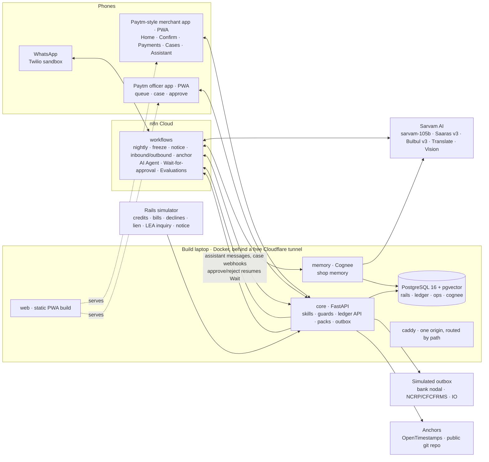

# Paytm Hisaab: implementation plan

**Execution update, 18 Sep 2026:** the user has prioritized a functioning prototype.
[PROTOTYPE_STATUS.md](PROTOTYPE_STATUS.md) records the active scope and completion status.
Build the real payments/questions/answers loop first, then freeze/evidence/approval/simulated
send. The larger design below remains the backlog; extra hardening, legal research, evaluations
and polish are deferred. Existing API contracts and lane ownership remain in force.
Payments, proposals, questions, answers and M1/M2 reads persist in Postgres. Repeatable reset
is complete, and CP1 passes on B's local stack; A's rerun with the credit window is pending.
Assistant forwarding and persisted app delivery are implemented; assistant SSE is deferred with M6.
A has delivered freeze isolation and actual JSON/English PDF packs (6.4/6.8 prototype scope),
the detector, approval/send gate and four case/officer reads (6.9/6.10/6.11 prototype scope).
The core HTTP lifecycle passes; the joint bounded WF20/officer-screen/merchant-tracker check
is next for CP2. Full-period tiers and notice/Indic PDFs remain deferred. Turnover (6.2),
threshold (6.3) and their report/read follow; `/app/turnover` still waits for 6.2.
Delegate one helper or endpoint per Cursor build job, with exact contracts and acceptance
checks, and validate it before assigning dependent work.

**Paytm Build for India AI Hackathon · Bengaluru · Track 3: Autonomous AI Teammates · Sat 19 Sep 2026**
Stack: n8n Cloud (voucher) · Sarvam AI · Cognee (hackathon credits) · Python/FastAPI · PostgreSQL · WhatsApp via Twilio · Paytm-style mobile PWA
Hosting: the build laptop behind a free Cloudflare tunnel. No paid infrastructure.
Team: 2 people · Build Thu 17 to Fri 18 Sep · Harden and demo on Sat 19 Sep

---

## 0. Context

`proposal/hisaab-proposal.tex` (the Round 1 deck) and `deck/hisaab-deck-v2.md` (the narrative and objection
handling) describe **Paytm Hisaab**: an autonomous AI teammate that keeps a tamper-evident
**provenance ledger** of every UPI credit a small merchant receives. When an authority asks
questions, it answers from that ledger:

- **Freeze:** it finds the one disputed payment among hundreds, builds a graded evidence pack,
  drafts the NCRP/CFCFRMS grievance and sends it to a Paytm officer for approval.
- **Tax notice:** it rebuilds real aggregate turnover with workings, says plainly when the
  merchant *did* cross the threshold, and explains the result to their CA.

The deliverable is a **working prototype, not a proof of concept**. Every box on the
architecture slide has to run: real WhatsApp, real Sarvam calls, real Cognee memory, real n8n
workflows with a human-approval step, and a real hash-chained ledger. It all runs on synthetic
data with known ground truth, so every number we show is measured.

**Decisions already made**

| Decision | Choice |
|---|---|
| Codebase | **Clean rebuild** on a new branch. The Phinite-era repo (`synth/`, `service/`, `tools/`, `PLAN.md`, `DATA.md`) is a *design reference only*: we reuse its algorithms and lessons (§21), not its code. No Claude API and no Phinite anywhere. |
| Old results | Figures like 1.6% turnover error or 189 questions a year are **targets to re-measure**, never claimed until the new system produces them. |
| Channel | **Real WhatsApp through the Twilio sandbox** (no Meta business portfolio, no verification) **plus the in-app Hisaab Assistant** inside the Paytm-style merchant app. Both use the same n8n flow, so either is a stage fallback for the other. Tap buttons live in the app; WhatsApp uses numbered replies and voice (§11). |
| Hosting | **No paid infrastructure.** Everything runs on the build laptop in Docker, reached through a free Cloudflare quick tunnel. `tasks.py publish` re-points n8n and Twilio whenever the tunnel hostname changes (§16). |
| Memory | **Cognee with hackathon credits** (code redeemed at platform.cognee.ai/billing), reached over HTTPS through our own memory service. Self-hosted Cognee in Docker stays as the offline fallback (§9). |
| n8n hosting | **n8n Cloud**, using the hackathon voucher (one month; it expires a week after the event). Live workflows run there. A self-hosted n8n in Docker, importing the **same workflow JSON**, is used for seeding and as an offline fallback. The voucher code stays out of git. |
| Frontend | **Phone-first, and as close to the Paytm for Business app as we can get**: Paytm navy/cyan palette, card and tile layout, bottom navigation, bottom sheets, one-tap chips. Built as an installable PWA at 360–412 px; on a laptop it renders inside a phone frame. |
| n8n prize | The design deliberately targets **"Best Use of n8n"** (§10.1): agent, human-in-the-loop, sub-workflows, error workflow, WhatsApp, Forms and Evaluations all in real use. |
| Credits during development | **None.** Every build, test, checkpoint and most rehearsals run against local stand-ins: self-hosted n8n and a fakes service that mimics Sarvam, Twilio and Cognee. Paid services are called only in five budgeted **live windows**, and the code refuses to call them otherwise (§16a). |
| Timeline | Build Thu evening and all of Friday. Saturday is hardening, rehearsal and deck numbers only. |
| Team | 2 workstreams: **A = Ledger and skills** (Python, data, eval); **B = Agent and surfaces** (n8n, Sarvam, Cognee, WhatsApp, web). |
| Merchant pronouns | they/their everywhere (code comments, prompts, UI copy, docs). |

---

## 1. What "done" means

### Acceptance criteria (all must pass on Friday night)

1. **Nightly run.** For any simulated date, n8n labels new credits: rules settle routine sales,
   Sarvam handles hard cases, and every proposal is appended to the chained ledger. At most 3
   questions a day are selected and sent on WhatsApp in the merchant's language.
2. **Conversation.** The merchant answers by button tap (in the app), a numbered reply (on
   WhatsApp), free text or a **voice note**, in any supported language. Answers are appended as *their claim* alongside the machine label and
   never overwrite it. Cognee remembers the shop, so the same payer relationship isn't asked
   about twice.
3. **Threshold watch.** Replayed as of 31 Jan, the merchant is warned of the projected ₹40L
   crossing date with the number of days of warning. That date is computed, never typed.
4. **Freeze response.** A lien plus a burst of declines opens a case automatically. The agent
   isolates the disputed credit **by UTR and, independently, by amount and date**, lists the
   same-amount decoy without choosing it, and attaches the bill. It builds a tiered evidence pack
   (PDF) and drafts the grievance from an allowlist of citations. **n8n waits for officer
   approval.** Only then does the pack go to the (simulated) outbox.
5. **Notice response.** The merchant photographs a notice on WhatsApp. Sarvam Vision reads it and
   extracts the fields, which are validated. The tax pack shows aggregate turnover (exempt plus
   taxable), the non-turnover lines traced to txn IDs, and the registration verdict. The
   merchant gets an explainer in their language and the CA gets an English export. Officer
   approval is required.
6. **Escalation.** Weak evidence, a large amount, a non-sale payment or a merchant dispute
   routes the case to a human with the reasons listed.
7. **Trust.** `GET /ledger/verify` passes. A tamper attempt through the app is refused. A
   tamper made directly in the DB is detected at the exact entry. A daily anchor is published
   outside the system (OpenTimestamps receipt plus a public git commit).
8. **Refusals, live.**
   - **Permission:** the evidence workflow tries to write a claim and gets a 403, visible in the
     n8n execution.
   - **Ethical:** the merchant asks to hide ₹7,500 to stay under ₹40L, and the agent declines and
     explains.
   - **No tip-off:** a police inquiry about a payment never produces a message to the merchant.
9. **Measured.** `eval/` reports label accuracy against the rules-only baseline, turnover error,
   questions per day, isolation accuracy across all eval freeze cases, tier shape for genuine
   versus fabricated histories, and case timings.
10. **Reset.** `demo reset` restores the seeded year in under 60 s, so rehearsals never burn
    the demo state.
11. **Paytm-style phone app.** The merchant app and the officer app are both installed as PWAs
    on real Android phones and run every beat at 360 px width with no horizontal scroll.
    Side by side with Paytm for Business screenshots, the header, cards, transaction rows,
    chips and bottom navigation read as the same family.
12. **n8n Cloud.** Every live workflow runs on the n8n Cloud instance. Importing the same JSON
    into the local n8n passes `beats` too, and the execution count for a full rehearsal is
    known and fits the plan's quota.
13. **Credit-free by default.** The full test suite, `beats`, CP1 and CP2 run with
    `HISAAB_LIVE=0` and make **zero** calls to Sarvam, Twilio, hosted Cognee or n8n Cloud; a
    network guard fails any test that tries. `tasks.py usage` shows live spend only inside the
    planned live windows, and within their budgets.

### Track 3 criteria mapped to features

| Criterion | Where it lives |
|---|---|
| Understands context | Cognee shop memory (payers, relationships, past answers, cases) plus as-of payer history |
| Makes decisions | Rules-then-agent labelling, question budget, choosing 1 payment out of 339, escalation rules |
| Takes actions | Builds packs, drafts grievances, sends WhatsApp messages, writes the ledger, opens cases, anchors |
| Works with humans | Merchant attests; officer approves in the console (n8n Wait with a resume webhook) |
| Escalates wisely | Deterministic escalation rules with reasons, plus an LLM-written handoff summary |
| Measurable outcomes | Time from freeze to pack to approval, share of balance kept usable, eval metrics dashboard |

---

## 2. Scope and priorities

**P0: the demo cannot happen without these**
Chained ledger with triggers and verification · synthetic world v2 (demo split) · rules and
Sarvam hard-case labelling · question budget · WhatsApp and in-app assistant conversation
(buttons, text, voice-in) in Kannada · Cognee shop memory used in labelling and chat · freeze
workflow end to end with officer approval · notice workflow (fallback: notice chosen from events
if OCR fails) · evidence tiers · threshold warning · all live workflows on **n8n Cloud** ·
**Paytm-style merchant app** screens M1 Home, M2 Confirm, M5 Case tracker and M6 Assistant ·
**officer app** screens O1 Queue and O2 Case with approve · permission and ethical refusals ·
demo remote and reset.

**P1: build Friday evening in this priority order; if late, cut from the end of the list**
Sarvam Vision OCR of a photographed notice → merchant app M3 Payments and M4 Payment detail →
stage view (two phone frames) → Bulbul voice replies and read-aloud → daily anchor
(OpenTimestamps and git) → M7 Turnover and CA share → n8n Evaluations on the labelling agent
→ second merchant in Hindi → police inquiry no-tip-off flow → eval split agent-vs-baseline run.

**P2: only if P1 is green**
Fabricated-history merchant for the tier-shape demo · outcome metrics tiles · judges scan a QR
to open a read-only merchant app on their own phones · n8n Insights screenshot for time saved ·
nightly run at scale over the dev split (7 merchants) · GitHub Actions CI.

**Out of scope**
Real Paytm, bank or NCRP integrations (all simulated and labelled as such) · filing anything ·
cash sales · lending, Hisaab Pro billing and other business-model features · marketing and
loyalty.

**Lines we won't cross, enforced in code rather than just stated**

| Line | Control |
|---|---|
| Never claims innocence | The `no-innocence-claim` guard rejects drafts that assert innocence or bona fides as fact; prompts forbid it; tests cover it |
| Nothing sent unapproved | `POST /outbox/send` refuses any pack without a `pack.approved` ledger entry by the officer role. Enforced in core, not only in n8n. |
| Never helps dodge tax | The tax pack always includes the registration verdict; no feature excludes a credit without a label; the intent `hide_income` routes to a fixed refusal |
| The LLM never does arithmetic | Every number comes from a skill. The `numbers` guard rejects LLM text containing any figure not in the facts payload. |

---

## 3. Architecture



**n8n Cloud calls into our services during the live windows, so core needs a public HTTPS
address then.** A free Cloudflare quick tunnel to the laptop provides it (§16): one hostname,
Caddy routing by path, every call carrying a role key. Day to day, the local n8n reaches core on
the Docker network and the tunnel is only for the phones, where HTTPS is what makes the PWA
installable and the microphone usable. In live windows, Twilio posts inbound WhatsApp straight
to n8n Cloud without touching the tunnel.

**Principles**
- **AI proposes, Python calculates, the ledger records, a person approves.** This matches the
  deck's pipeline slide one to one.
- **n8n is the visible spine.** Every agent step is an inspectable node. Core holds the
  deterministic skills and enforces permissions. Workflows call core with a **role-scoped key**.
- **As-of discipline.** Every skill takes `as_of` (the simulated clock) and reads nothing later.
  The old repo leaked future data (see §21).
- **Memory is context, never evidence.** Cognee informs proposals and conversation. Packs cite
  only ledger entries, bills and rails data.
- **Nothing reads `hidden/`** except `sim/` and the `eval/` harnesses.
- **Credit-free by default.** Development talks to local fakes. Paid services are reached only
  when `HISAAB_LIVE=1`, which only the live windows set (§16a).

---

## 4. Repository layout

Work happens on branch `bfi`. The first commit moves the old tree to
`archive/agent-labs-2026-09-12/`, which is never imported. The untracked pitch files stay where
they are.

```
.
├── IMPLEMENTATION_PLAN.md
├── README.md                      rewritten for BFI (architecture, quickstart, demo)
├── docker-compose.yml             postgres, core, memory, web, caddy; profile `local-n8n` adds n8n for seeding and fallback
├── .env.example
├── tasks.py                       cross-platform task runner (invoke): up, seed, reset, eval, export-n8n
├── sim/                           synthetic world v2 (stdlib only)
│   ├── catalog.py  world.py  scenario.py  notices.py  generate.py
├── services/
│   ├── core/                      FastAPI, SQLAlchemy 2, psycopg 3, Alembic, Pydantic v2 (uv)
│   │   ├── app/main.py  auth.py  clock.py  config.py
│   │   ├── app/rails/             ingest, freeze detector, event fan-out to n8n
│   │   ├── app/ledger/            chain.py, kinds.py, projection.py, verify.py, anchor.py
│   │   ├── app/skills/            classify_rules, payer_history, question_budget, turnover,
│   │   │                          threshold, isolate, tiers, escalation, packs, grievance
│   │   ├── app/guards/            numbers, citations, no_innocence, extraction, language
│   │   ├── app/ops/               cases, approvals, outbox, media, phone-sim bus (SSE)
│   │   ├── app/render/            pack HTML → PDF (WeasyPrint, Noto Indic fonts)
│   │   ├── app/schemas/           LLM output schemas → exported JSON Schema for n8n
│   │   ├── migrations/            Alembic (incl. ledger triggers + role grants)
│   │   └── tests/
│   ├── memory/                    FastAPI wrapper over Cognee (pinned), one stable interface
│   ├── fakes/                     local stand-ins for Sarvam, Twilio and hosted Cognee, with
│   │                              record/replay cassettes (§16a)
│   └── web/                       phone-first PWA: React + Vite + TS + Tailwind + TanStack Query
│       ├── src/design/            Paytm-style tokens, typography, icons, motion (§12.1)
│       ├── src/components/        AppBar, BottomNav, TileGrid, TxnRow, Chip, BottomSheet,
│       │                          StickyCTA, Stepper, TierBar, AmountText, MicButton, PhoneFrame
│       ├── src/apps/merchant/     M1–M7 screens
│       ├── src/apps/officer/      O1–O3 screens
│       ├── src/apps/demo/         demo remote, stage view, ledger explorer, eval
│       └── e2e/                   Playwright on mobile viewports
├── design/reference/              Paytm for Business screenshots for the team's reference (gitignored)
├── n8n/
│   ├── workflows/                 exported JSON, one file per workflow, committed
│   └── README.md                  Cloud setup, credentials to create, import/export through the n8n public API
├── prompts/                       versioned prompt files, served by core GET /prompts/{name}
├── legal/citations.yaml           allowlist: SOP, AP HC, Rajasthan HC, CGST s.2(6)/22/23/25 + sources
├── i18n/                          UI and message templates per language (generated, reviewed)
└── eval/                          score.py, baseline.py, simulate_merchant.py, beats.py, report.py
```

---

## 5. Synthetic world v2 (`sim/`), owned by A

Rewrite the generator using `DATA.md` as the spec: the same process model, labels, difficulty
knob and visible/hidden split. Extend it for what the new product needs.

**Kept from the spec:**
- the 7 true labels, with `unclassified` allowed only as an answer
- shop archetypes: veg_vendor, mixed_kirana, family_kirana, mobile_accessories, darshini,
  composition_kirana
- the difficulty cues
- the duplicate/refund, family money, loans/chit and fraud chain processes
- the thresholds: ₹40L for goods, ₹20L for services, crossing when strictly above
- aggregate turnover includes exempt sales (CGST s.2(6)); exclusively-exempt suppliers don't
  need to register (s.23)

**New in v2**

| Addition | Why |
|---|---|
| `terminals.json`: device id, geo, installed_at | Evidence of "the bill, the device, the location" |
| `rails_events.json`: `payment_declined` bursts, `lien_marked` (NCRP ack, case ref, amount/date/UTR), `lea_inquiry`, `notice_served` | Drives automatic freeze detection and the no-tip-off flow |
| `notices/*.pdf/.jpg`: a rendered GST notice marked SPECIMEN (plus a phone-photo variant) | Real OCR input for Sarvam Vision |
| Merchant behaviour model (hidden): answer delay, error rate, late corrections, post-notice annotations | Exercises tiers 3 and 4 honestly |
| Second demo merchant: exclusively-exempt veg vendor in Lucknow, Hindi | Shows "any language" and the exclusively-exempt verdict |
| A `fabricated_history` merchant in eval: mule-like, whose history is mostly tier 3/4 claims added after a lien | Tier-shape sorting ("we sort, we don't advocate") |
| Balances and settlements (visible) | Metric: share of balance kept usable under a lien-only hold |

**Demo scenario (Sahana Stores, Jayanagar, Kannada, FY 2025-26).** These are seeded facts,
asserted at generation time:
- 3 seeded credits on 8–9 Mar for the 10 Mar questions: own savings ₹15,000, spouse ₹7,500,
  and a repeat customer's ₹4,850 sale
- a ₹23 payment nobody can place
- the ₹40L crossing on 14 Mar
- a notice claiming gross credits of about ₹60.98L
- a lien at 09:30 on 24 Mar for a ₹4,200 `UPI_POS` sale at 19:47 on 21 Mar, with a POS bill
  (onions and more) on till POS01
- a same-amount decoy from a regular customer on 18 Mar
- 339 credits in the 7 days before the freeze

`demo_scenario.json` is the answer key for these.

**Outputs:** `data/<split>/{visible,hidden}` for the demo, dev, eval and sweep splits. The CLI is
`python -m sim.generate [--only demo]`, with fixed seeds.

---

## 6. The provenance ledger (Postgres), owned by A

### Tables

| Schema.table | Purpose |
|---|---|
| `rails.merchants`, `rails.terminals`, `rails.counterparties` | Profile, device, payer identity |
| `rails.credits`, `rails.debits`, `rails.bills`, `rails.bill_lines`, `rails.events` | What Paytm sees, loaded by the rails replayer up to the sim clock |
| **`ledger.entries`** | Append-only, hash-chained per merchant |
| `ledger.chain_heads` | Current head per merchant; row-locked on append |
| `ledger.anchors` | Daily digest, OTS receipt, git commit URL |
| `ops.cases`, `ops.packs`, `ops.approvals`, `ops.outbox`, `ops.questions`, `ops.conversations`, `ops.media`, `ops.payer_facts`, `ops.escalations`, `ops.metrics` | Working state; everything that matters is also mirrored as a ledger entry |

### `ledger.entries`

```
seq bigserial PK · merchant_id · chain_index int · kind text · txn_id text null
payload jsonb · actor_role text · actor_ref text
sim_at timestamptz        -- business clock (replayed history)
recorded_at timestamptz   -- DB clock_timestamp(), never supplied by the caller
prev_hash bytea · hash bytea
hash = sha256( canonical_json({merchant_id, chain_index, kind, txn_id, payload,
                               actor_role, sim_at, recorded_at}) || prev_hash )
```

**Enforcement**
- A `BEFORE UPDATE OR DELETE OR TRUNCATE` trigger raises an exception.
- The app DB role gets `INSERT, SELECT` only. Migrations run as a separate owner role.
- Core checks which `kind`s each API role may append (§14).

**Entry kinds**

| Kind | Written by | Notes |
|---|---|---|
| `credit.observed`, `bill.linked` | rails | |
| `label.proposed` | provenance | `{label, source: rule\|agent, rule_id \| model+prompt_version, confidence, reason, evidence_refs, memory_refs}` |
| `question.asked` | conversation | |
| `claim.answered` | conversation | `{question_id, label, raw_text \| media_sha256, language}` |
| `claim.annotated` | conversation | merchant-initiated correction |
| `label.disputed` | conversation | |
| `case.opened` | rails / evidence | |
| `pack.built` | evidence | `{pack_id, pdf_sha256, tier_totals}` |
| `pack.approved`, `pack.rejected` | officer | |
| `pack.sent` | core outbox | |
| `anchor.created` | anchor job | |

**Projection.** `ledger.current_view(merchant, as_of)` is a SQL function returning one row per
credit:
- `machine_label`: latest proposal, never removed
- `claim_label`: latest claim, if any
- `effective_label`: the claim if present, else the machine label
- `tier`, `conflict` (for example, a claim contradicts a bill)
- the entry refs behind each field

Nothing is ever overwritten. The view is derived.

### Evidence tiers (computed in `skills/tiers.py`, relative to the case's `opened_at`)

| Tier | Rule |
|---|---|
| **1 Backed by a bill** | `bill.linked` recorded before the case, and the effective label is a supply consistent with the bill lines |
| **2 Derived by a rule** | `label.proposed` (rule, or agent working from the payment's own data) before the case, with no claim |
| **3 Their answer when asked** | `claim.answered` to a system `question.asked`, recorded before the case (a label inherited from an earlier answer about the same payer is also tier 3, with a reference) |
| **4 Added after the notice** | `claim.annotated`, or anything recorded after `opened_at`. Shows the lag in days and whether it came before or after the notice. |

Every pack shows ₹ and count per tier, plus a **shape** figure: the share of ₹ in tiers 1+2.
That shape is what separates a genuine shop from a fabricated history.

### Anchoring and the tamper demo
- **Daily job (WF60).** Digest = sha256 of the sorted `(merchant_id, chain_index, hash)` heads
  → submitted to OpenTimestamps (`opentimestamps-client`), with the `.ots` receipt stored →
  also committed to a public `hisaab-anchors` GitHub repo through the API, for an instant
  public timestamp → an `anchor.created` entry is appended.
- **Honesty note.** Anchors for the *replayed* year are created during seeding and labelled
  `simulated`. Anchors made live during the demo are real.
- **`GET /ledger/verify?merchant=`** recomputes the chain and checks it against the anchors. It
  returns `ok`, or `broken_at: chain_index` together with the first anchor that disagrees.
- **Demo panel "Tamper".** (a) An app-level `UPDATE` fails at the trigger. (b) As superuser, the
  panel disables the trigger, edits one label and re-enables it. Verify then flags that exact
  entry, and the officer app (O2) shows a red chain badge.

---

## 7. Core service (FastAPI): skills and API, owned by A

**Auth.** Header `X-Hisaab-Key` → one role:
`rails`, `provenance`, `conversation`, `evidence`, `officer`, `admin`.

Each n8n workflow uses only its own role's HTTP Header Auth credential. Core returns a **403
with a readable reason**, which appears in the n8n execution log.

| Endpoint | Roles | Does |
|---|---|---|
| `POST /rails/credits`, `/rails/bills`, `/rails/events` | rails | Ingest; append `credit.observed`/`bill.linked`; the freeze detector opens a case and calls the n8n webhook |
| `GET /merchants/{id}`, `/credits?as_of`, `/credits/{txn}`, `/credits/by-utr/{utr}` | all agent roles | Reads |
| `GET /payers/{cp}/history?merchant&as_of` | all agent roles | **Strictly prior** counts, channels, whether the merchant has paid them, twins, own-account and surname cues, `payer_facts` |
| `POST /skills/classify-rules` (batch) | provenance | Deterministic label, confidence, rule_id and ask flags, or `null` for a hard case |
| `POST /ledger/proposals` | provenance | Validates the enum and caps agent confidence (≤0.85), then appends `label.proposed` |
| `POST /skills/select-questions` | provenance | Budget of ≤3 a day (below) |
| `POST /ledger/questions`, `/ledger/claims` | conversation | Append `question.asked`, `claim.answered`/`annotated`/`label.disputed`; update `payer_facts` |
| `POST /skills/turnover` | evidence | Aggregate = exempt + taxable. Unbilled QR sales are apportioned by value from the shop's billed exempt share, marked as an estimate. Excluded buckets with txn IDs. Coverage. Workings. |
| `POST /skills/threshold` | evidence | Already-crossed date, or a projection from the trailing-60-day run rate; days of warning; ₹40L/₹20L by supply kind; exclusively-exempt check; **respects gst_status** |
| `POST /skills/isolate` | evidence | Match by UTR, **and independently** by amount ± date window; `found_by: [utr, amount_date]`; same-amount candidates listed; bill, device, geo; 7-day count |
| `POST /skills/tiers`, `/skills/escalation-check` | evidence | Tier totals and shape; escalation decision with reasons |
| `POST /cases`, `POST /packs` | evidence | Build the pack JSON and PDF, append `pack.built`; **cannot** touch labels or claims |
| `POST /guards/{numbers\|citations\|no-innocence\|extraction\|language}` | all | Pass/fail with offending spans |
| `POST /packs/{id}/approve\|reject` | officer | Appends an entry and resumes the n8n Wait through its stored `resume_url` |
| `POST /outbox/{pack}/send` | officer | Refuses without `pack.approved`; writes to the simulated destination and appends `pack.sent` |
| `GET /ledger/verify`, `GET /ledger/{m}/entries`, `GET /anchors` | officer, admin | Trust views |
| `POST /sim/clock`, `/sim/replay`, `/sim/reset`, `/sim/tamper`, `/anchors/run` | admin | Demo control |
| `POST /assistant/inbound` (text, audio, image/PDF), `GET /assistant/stream` (SSE), `POST /assistant/outbound` | merchant app, conversation | In-app Hisaab Assistant; inbound forwards to the same n8n webhook WhatsApp uses |
| `GET /app/home`, `/app/payments`, `/app/payments/{txn}`, `/app/cases`, `/app/turnover` | merchant app | Screen-shaped read models (one call per screen, preformatted ₹ strings per locale) so the phone stays fast |
| `GET /app/officer/queue`, `/app/officer/cases/{id}` | officer app | Screen-shaped read models for the officer screens |
| `POST /app/push/subscribe` | both apps | Web Push subscription for alerts and approval requests (P1) |
| `GET /prompts/{name}` | all | Versioned prompt text; the version is logged in entries |

### Question budget (`skills/question_budget.py`)

1. **Candidates.** A proposal is a candidate if any of these hold:
   - no label, or confidence below 0.75
   - a non-sale credit of ₹10,000 or more
   - a sale of ₹3,000 or more from a payer with ≤3 **strictly prior** credits and no bill

   Never ask below ₹500. Never ask about a payer whose relationship is already in
   `payer_facts`.
2. **Priority.** `amount × (1 − confidence) × proximity`, where proximity is 1.5 when projected
   turnover is within 15% of the threshold.
3. **Budget.** At most **3 a day**, least confident first. Unasked candidates expire after 7
   days: they stay machine-labelled or `unclassified` and are never guessed.

### Escalation rules (`skills/escalation.py`; thresholds live in config and are verified, §22)

Any one of these routes the case to a human specialist rather than routine approval:
- disputed amount above the SOP small-sum limit (₹50,000, pending verification)
- disputed credit not in tier 1 or 2
- effective label is not an ordinary goods or services sale
- a claim conflicts with a bill, or the merchant disputes a label
- tier-3+4 share of the period's ₹ above 40%
- a second freeze within 90 days

---

## 8. AI layer (Sarvam), owned by B

During development every call below goes to the local fakes, which replay recorded responses
(§16a). Only the live windows reach Sarvam.

| Use | Model | In | Out (validated by core) |
|---|---|---|---|
| Hard-case labelling | `sarvam-105b` | Credit, as-of payer history, rules output, Cognee recall | `{label∈enum∪unclassified, confidence, reason_en, evidence_used[]}` |
| Intent of a merchant message | `sarvam-105b-conversations` (tool calling) | Transcript and pending questions | One of `answer_question, ask_status, report_freeze, send_notice, correct_label, dispute_label, hide_income, help, other`, plus slots. Button taps skip the LLM. |
| Voice in | Saaras v3 (transcribe/codemix) | WhatsApp OGG/Opus (ffmpeg → WAV if needed) | Transcript and detected language |
| Voice out (P1) | Bulbul v3 | Final reply text | Audio sent as a WhatsApp voice note |
| Message templates | Sarvam-Translate | English templates with protected `{placeholders}` | `i18n/<lang>.json`, generated once, batched, in live window L1 (§16a); Kannada and Hindi reviewed by a person |
| Notice reading | Sarvam Vision (document intelligence) → `sarvam-105b` extraction | Photo or PDF | `{authority, reference, date, period, claimed_turnover, allegation, due_date}`; the extraction guard requires each number to appear in the OCR text |
| Grievance facts paragraph | `sarvam-105b` | Structured pack facts | Plain-language paragraph; numbers, citations and no-innocence guards; the template supplies structure and citations |
| CA explainer and merchant explainer | `sarvam-105b` | Tax pack JSON | English for the CA, merchant's language for them; numbers guard |
| Officer handoff summary | `sarvam-105b` | Case and escalation reasons | Short summary; numbers guard |

**Rules**
- All prompts live in `prompts/*.md` with a version header.
- Outputs are parsed against the JSON Schemas exported from `services/core/app/schemas`.
- On a guard failure, retry once with the violation fed back. Then fall back to the
  template-only text, which is always available.
- Numbers never pass through the LLM. Templates hold `{amount}` slots and core formats them in
  the Indian style (lakh, commas) per language.

---

## 9. Memory (Cognee), owned by B

`services/memory` wraps Cognee v1.x, pinned to the version tested in spike S6. It exposes a
stable interface so the rest of the system never depends on how Cognee's API changes:

```
POST /remember  {merchant_id, kind, text, facts?, session_id?}
POST /recall    {merchant_id, query, session_id?, top_k}
POST /improve   {merchant_id}
POST /forget    {merchant_id}   (demo reset)
```

- **Two backings, one interface.**
  - **Hosted Cognee (default), paid for by the hackathon credits.** Redeem the code at
    platform.cognee.ai/billing on Thursday. The memory service holds the API key and talks to
    the platform over HTTPS, which also means n8n Cloud never needs the tunnel to reach memory.
    Only synthetic data is ever sent.
  - **Self-hosted Cognee in Docker (fallback).** The LLM is Sarvam through LiteLLM as an
    OpenAI-compatible custom endpoint, embeddings are **fastembed** locally with no key, and
    storage is Postgres with pgvector in a separate `cognee` database with an embedded Kùzu
    graph.

  `MEMORY_BACKEND=hosted|self|stub` switches between them. **Development uses `stub`, or `self`
  with its LLM pointed at the fakes**, so memory costs nothing; `hosted` is used only in live
  windows (§16a). Live check S6 proves both before anything depends on either. In seed mode,
  memory writes are batched and `improve` runs once at the end, not once per day.
- **Configuration.** One dataset per shop (`shop_<merchant_id>`), the same on both backings.
- **What is remembered:**
  - the shop profile narrative
  - payer relationships learned from claims ("handle X is the owner's spouse, per their answer
    on 10 Mar")
  - conversation sessions
  - case outcomes and officer notes
  - language and time-of-day preferences
- **Where it is used:**
  - hard-case labelling, as context
  - the conversation ("what was that ₹7,500?", "why do you ask?")
  - the escalation summary

  `improve()` runs at the end of each nightly run.
- **Guardrail.** Recalled memory that influences a proposal is logged in `memory_refs` and never
  counts toward tiers 1 or 2. Payer facts that rules depend on are also written
  deterministically to `ops.payer_facts`.
- **Fallback.** If Cognee's LLM extraction misbehaves, write typed DataPoints directly, with no
  LLM extraction. If the credits run out or the platform is unreachable, switch
  `MEMORY_BACKEND` to `self`. If both are down, `/recall` returns empty with `degraded: true`,
  and labelling continues with a lower confidence cap, which produces more questions and never
  wrong labels.

---

## 10. n8n workflows, owned by B

Live workflows run on **n8n Cloud**, redeemed with the hackathon voucher on Thursday. Check the
instance version in the Cloud admin panel: human review of AI tool calls needs 2.6 or later.
Workflow JSON is committed, and `tasks.py export-n8n` and `import-n8n` round-trip it through the
n8n public API (the API key comes from Cloud settings). The same files import into the local
n8n (`docker compose --profile local-n8n up`).

**All development and testing happens on the local n8n against the fakes.** Its credentials
point at `services/fakes`, so nothing spends credits. Workflows are imported into n8n Cloud, and
its live credentials created, only in live window L2 (§16a).

| ID | Trigger | Steps |
|---|---|---|
| **WF10 nightly-provenance** | Schedule 02:00 IST; webhook `{merchant?, as_of, mode: live\|seed, from?, to?}` | Credits since the last run → classify-rules → split: settled ones go to proposals (batch); hard cases loop through memory recall, the Sarvam labelling agent, the schema check and proposals → select-questions → (live) WF30 morning questions → threshold → (warning due) WF30 warning → memory improve → WF60 |
| **WF30 merchant-outbound** (sub) | Execute Workflow | Template and language → optional Bulbul → channel switch: Twilio through an HTTP Request node with a configurable base URL, so development hits the fakes (numbered replies, one message every three seconds, inside the 24h window) or core `/assistant/outbound` (the in-app assistant, plus a Web Push nudge) → `question.asked` or log |
| **WF31 merchant-inbound** | Webhook from Twilio (`X-Twilio-Signature` checked in a Code node); webhook from the in-app assistant | Normalise → audio goes to Saaras → an app button tap or a WhatsApp numbered reply routes directly, otherwise intent via Sarvam → switch: answers to `/ledger/claims`; status via turnover/threshold → reply; `report_freeze` → WF20 lookup; notice image/PDF → WF40; correction → `claim.annotated` (tier 4, told so); dispute → WF50; `hide_income` → fixed refusal → reply (guards) → memory remember (session) |
| **WF20 freeze-response** | Core webhook on `case.opened(freeze)` | isolate → payer history and bill → tiers → escalation-check → grievance (template, Sarvam facts paragraph, guards) → packs (PDF) → WF30 acknowledgement to the merchant (no claims, no promises) → approval record with `$execution.resumeUrl` → **Wait (resume on webhook)** → approved: outbox send, WF30 status, metrics / rejected or escalated: WF50 |
| **WF21 lea-inquiry** (P1) | Core webhook on `lea_inquiry` | Same evidence assembly → officer approval → outbox reply. **No WF30 node exists in this workflow**; a test asserts it. |
| **WF40 notice-response** | WF31, or core webhook on `notice_served` | Media → Sarvam Vision → extraction → extraction guard → case → turnover, threshold and tiers → tax pack PDF → CA and merchant explainers → approval Wait → deliver: explainer to the merchant, English export link for the CA |
| **WF50 escalation-handoff** (sub) | Execute Workflow | Escalation record with reasons → Sarvam handoff summary → officer app queue (O1) → WF30 "a person from Paytm will review this" |
| **WF60 daily-anchor** | Schedule 23:55 IST; called by WF10 in seed mode | core `/anchors/run` (OTS and git) → `anchor.created` |
| **WF90 error-handler** | n8n error workflow | Log to `ops`, alert card in the officer app |
| **WF99 refusal-probe** | Manual (demo) | Evidence credential tries `POST /ledger/claims` → shows the 403 reason |

**Seed mode.** WF10 walks the year day by day with no messaging.
`eval/simulate_merchant.py` is a harness that reads the hidden behaviour model. It answers each
day's selected questions through the conversation API, using realistic delays, a few errors and
later corrections. All of this uses the sim clock, so a year of chain history exists before the
demo starts. At the end, `pg_dump` saves a **seed snapshot**, which reset restores.

Seed mode runs on the **local n8n** against the local core, never on Cloud. A year of daily runs
plus their sub-workflows would burn a large share of the Cloud execution quota, because Cloud
counts sub-workflow, manual and test runs.

During development the seed runs against the fakes, for free. **The demo's final seed runs once,
in live window L2**, so the year's AI proposals come from the real model; that snapshot is then
reused by every rehearsal, because `reset` restores it.

### 10.1 Making it the best use of n8n (prize track)

The goal is for n8n to *be* the teammate's visible brain, not a thin webhook relay. Each item
below is real product logic, not decoration:

| n8n capability | Where we use it |
|---|---|
| **AI Agent node** with Sarvam through an OpenAI-compatible chat model credential | WF31 intent and reply agent; its **tools** are HTTP Request Tool nodes calling core skills with the conversation role key |
| **Structured Output Parser** or Basic LLM Chain | WF10 hard-case labelling, WF40 notice extraction (schemas exported from core) |
| **Human review of AI tool calls** | The WF31 agent's `record_correction` tool needs merchant confirmation before it runs |
| **Wait node, resumed by webhook** | WF20/WF40/WF21 pause for officer approval; the officer app calls `resumeUrl` |
| **n8n Form Trigger** | Fallback approval page, and a CA upload form ("send us the notice") |
| **Webhook plus HTTP Request to Twilio** | WF31 inbound (signature checked in a Code node) and WF30 outbound (numbered replies, audio); the base URL is a credential, so the same nodes hit the fakes in development |
| **Execute Workflow (sub-workflows)** | WF30 outbound and WF50 escalation, reused by every flow |
| **Schedule Trigger** | WF10 nightly at 02:00 IST, WF60 anchor at 23:55 IST |
| **Error workflow** | WF90 for every workflow: logs to `ops` and posts an alert card to the officer app |
| **Evaluations** (Evaluation node with an n8n Data Table dataset) | `WF10-eval`: about 50 labelled hard cases from the eval split, metrics for label match and "asked when unsure", shown on stage from the n8n Evaluations tab (P1) |
| **Execution history and pinned data** | The demo shows the WF20 execution graph live; pinned data makes workflows testable without spending Sarvam calls |
| **Workflow and tag naming** | `hisaab/WF20 freeze-response` and so on, with sticky notes on every workflow explaining each lane (judges open them) |

### 10.2 n8n Cloud constraints and how we design for them

| Constraint | Design response |
|---|---|
| **Execution quota** (the voucher tier's monthly cap covers production, manual and sub-workflow runs) | Development runs on the local n8n, so Cloud executions happen only in live windows (§16a). Batch inside one execution (Loop Over Items rather than one sub-workflow per credit); seed on local n8n; count executions per rehearsal on Thursday and budget for them. A full demo run should need about 25 executions. |
| **Concurrency limit** on production executions | Freeze and notice flows are rare; WhatsApp inbound queues briefly, which is acceptable |
| **`$env` is blocked in nodes** | All config comes from **credentials** (one HTTP Header Auth per role key, Sarvam, WhatsApp) plus a `GET /config` call to core; nothing is read from env |
| **Webhook response time** | Core fires webhooks fire-and-forget; workflows answer immediately with "Respond to Webhook" and continue asynchronously |
| **No custom npm or community nodes guaranteed** | Only built-in nodes; all Python lives in core |
| **Voucher expires a week after the event** | Export all workflows to git after every checkpoint; the local n8n profile keeps the project runnable afterwards |
| **Cloud outage or network trouble on stage** | Switch `N8N_BASE_URL` in core to the local n8n (workflows already imported, credentials already created) and re-point the WhatsApp webhook: under 5 min, rehearsed once |

---

## 11. Channels, owned by B

**WhatsApp (Twilio Sandbox for WhatsApp)**

Meta's Cloud API needs a business portfolio and verification, so we use Twilio's sandbox
instead: a Twilio account and the shared sandbox number `+1 415 523 8886`, with nothing to
verify.

- **Joining.** Each phone sends `join <two-word code>` to the sandbox number once. **The join
  expires three days later**, so every phone re-joins on demo morning (§17, Saturday).
- **Inbound.** Twilio posts each message to an **n8n Cloud webhook**, which is already public,
  so the tunnel is not in this path. WF31 starts with a Code node that checks
  `X-Twilio-Signature` (HMAC-SHA1 of the URL and sorted parameters with the auth token) and
  drops anything that fails.
- **Outbound.** The n8n Twilio node, or an HTTP Request, sending from
  `whatsapp:+14155238886`. **The sandbox allows one message every three seconds**, so the
  three questions go one at a time behind a short Wait.
- **No tap buttons on this channel.** Interactive quick replies need approved WhatsApp
  templates, which the sandbox does not offer. Questions therefore go out as numbered options:
  *"₹15,000 on Sunday night. Reply 1 sale · 2 family · 3 my own money · 4 not sure"*. The reply
  parser accepts a digit, a word in any supported language, or a voice note. Numbered replies
  are how most Indian WhatsApp bots already work, so this is realistic rather than a
  compromise. **The tap experience lives in the in-app assistant** (M2 and M6), which we
  control end to end.
- **Business-initiated messages still need a pre-approved template**, and the sandbox only has
  generic ones. So the morning nudge is either sent inside the 24-hour window the merchant
  opened by messaging first, or delivered in the app with a Web Push nudge. In the demo the
  merchant always speaks first (the voice note about declining payments), which opens the
  window.
- **Media.** Voice notes and notice photos arrive as Twilio media URLs, fetched with the
  account SID and auth token into `ops.media` with a sha256. Outbound audio (Bulbul) has to be
  a public URL, which the tunnel provides.
- **Cost.** The sandbox allows 100 free messages, inbound and outbound both count, and a join
  costs 2. That's tight, so every live window has a Twilio budget (§16a).
- **In development, Twilio is the fakes service.** WF30 and WF31 reach Twilio through a
  configurable base URL, so locally they hit `services/fakes`. It captures outbound messages in
  a local outbox page, and `tasks.py fake-wa "1"` posts a signed inbound message. Real WhatsApp
  is used only in live windows.

**In-app Hisaab Assistant** (screen M6 of the merchant app, §12)
- The same conversation, inside the Paytm-style app: chat bubbles, tappable chips, hold-to-talk
  mic (MediaRecorder), camera or file upload for a notice, and audio playback for voice replies.
- It posts to core `/assistant/inbound`, which forwards to the **same WF31 webhook**, and
  receives replies over SSE. A Web Push nudge brings the merchant back into the app.
- Product story: the merchant can use Hisaab in the Paytm app they already have, or on
  WhatsApp. For the demo, each channel is the other's fallback, and the conversation logic is
  identical.

---

## 12. Frontend: a Paytm-style, phone-first PWA (`services/web`), owned by B

**The bar:** a Paytm product manager should look at it on a phone and see a tab that belongs in
Paytm for Business, not a hackathon dashboard.

**Principles**
- **Phone first.**
  - Design at 360×800 (a small Android phone); test at 360, 390 and 412 px wide.
  - Touch targets at least 48 px; primary actions in the thumb zone (a sticky bottom button).
  - One decision per screen, nothing that only works on hover, and respect safe-area insets.
- **Installable PWA** (`vite-plugin-pwa`).
  - Manifest with standalone display, navy theme colour, app icons.
  - An offline shell that keeps the last Home data.
  - The team's and demo phones install it from the tunnel URL with "Add to Home screen".
- **Laptops and the projector.** A `PhoneFrame` wrapper centres the app in a device bezel
  (412×892). `/stage` shows the merchant and officer phones side by side.
- **Branding, handled responsibly.**
  - The "Paytm Hisaab" wordmark is set in type using Paytm's colours.
  - No copied Paytm logo files, proprietary icons or illustrations.
  - A small "Prototype · synthetic data" tag sits in the profile screen and footer, and on
    every pack.
- **Stack:** React, Vite, TypeScript, Tailwind (theme generated from `design/tokens.ts`),
  TanStack Query, vaul for bottom sheets, lucide icons, framer-motion for small transitions.
  Screens read the `/app/*` read models (§7), one call per screen.

### 12.1 Design system (Paytm-style tokens)

On Thursday night, capture 8–10 screenshots of the Paytm for Business app (Home, transaction
list, transaction detail, settlements, Soundbox, help chat) into `design/reference/`
(gitignored). Tune the tokens against them before building screens.

| Token | Value (starting point) | Used for |
|---|---|---|
| `navy` | `#002970` | Header band, headings, the "Paytm" half of the wordmark |
| `cyan` | `#00BAF2` | Primary buttons, active tab, progress, links |
| `cyan-50` | `#E8F8FE` | Icon tile backgrounds, selected chips |
| `bg` / `card` / `hairline` | `#F5F7FA` / `#FFFFFF` / `#E6ECF2` | Page, cards, dividers |
| `ink` / `muted` | `#101828` / `#667085` | Text |
| `credit` | `#12A150` | "+₹" amounts |
| `alert` / `notice` | `#E5484D` / `#B45309` | Freeze banners / tax notice banners |
| `tier1…tier4` | green-700, green-400, amber, red | Tier bar and badges, matching the deck |
| Radius | card 16 · chip full · sheet 24 (top) | |
| Elevation | `0 1px 3px rgba(16,24,40,.08)` only | Flat, Paytm-like cards |
| Type | Inter (tabular numerals for amounts), with Noto Sans Kannada, Devanagari, Tamil, Telugu, Bengali, Gujarati, Malayalam, Gurmukhi and Oriya as fallbacks · sizes 12/14/16/20/28 · amounts weight 700 | |
| Icons | 24 px line icons inside 48 px rounded-square cyan-50 tiles, in a 4-column grid | The Paytm icon-grid look |
| Motion | 150–200 ms ease-out; sheets slide up; a tick animation on confirm; skeleton loaders, not spinners | |
| Formatting | Indian grouping: ₹4,200 · ₹42.2 L · ₹1.2 Cr; "21 Mar, 7:47 PM"; formatted in core per locale | |

**Components** (`src/components`):
- Structure: `AppBar` (back, title, language pill, help), `HeaderBand` (business name and
  today's collection), `BottomNav`, `PhoneFrame`
- Content: `TileGrid`, `Card`, `TxnRow` (initial avatar, name, time, channel icon, green +₹,
  label chip, tier dot), `AmountText`, `EmptyState`
- Actions: `Chip`/`ChipGroup` (one-tap answers), `StickyCTA`, `MicButton` (hold to talk, with
  a waveform), `LanguagePicker` (tiles in each language's own script), `Snackbar`
- Sheets and progress: `BottomSheet`, `Stepper` (order-tracking style), `ThresholdProgress`
  (bar with a ₹40L marker and the projected date), `TierBar`

### 12.2 Merchant app: Paytm for Business, with Hisaab inside

Bottom navigation has four tabs: **Home · Payments · Hisaab · Assistant**.

| # | Screen | What's on it | Beat |
|---|---|---|---|
| M0 | Language and consent | Language tiles in their own scripts; one-screen consent: "Hisaab asks at most 3 questions a day" | Setup |
| M1 | Home | Navy header band: business name, "Today ₹18,340 · 64 payments" · alert banner, red ("Payments on hold. We're working on it.") or amber ("Tax notice received") · **Hisaab card**: "3 payments to confirm" button plus threshold progress with projected date · tile grid: Payments, Settlements\*, Soundbox\*, Hisaab, Share with CA, Language (\*static) | All |
| M2 | Confirm payments | One card at a time: large amount, time, payer, channel icon, the question in their language ("₹15,000 on Sunday night. Your own money?") · chips: Sale · Family · My own money · Loan/other · Not sure · mic to answer by voice · "1 of 3" dots · tick, then auto-advance · at the end: "Done for today. 36 other payments were settled automatically." | Ordinary Tuesday |
| M3 | Payments | Search, filter chips (Today, This week, Needs you, Not a sale), `TxnRow` list with sticky day headers and day totals | Trust |
| M4 | Payment detail (bottom sheet) | Amount, UTR, time, till, device, bill items · **"What Hisaab recorded"**: the machine label and their answer side by side, each dated with a tier badge · "Add a note", which warns that notes added now are marked as added later | Trust |
| M5 | Case tracker | Order-tracking stepper: Payments on hold (09:30) → Disputed payment found (₹4,200, 21 Mar, 7:47 PM) → Evidence pack ready → Paytm officer reviewing → Sent to bank and police → Hold narrowed to ₹4,200 · "Usable balance" card · what happens next, in plain words, never claiming innocence · **tax variant**: notice summary, claimed vs actual turnover, "You crossed ₹40 lakh on 14 Mar. You need to register." and a Share with CA button | Freeze, Notice |
| M6 | Assistant | Paytm-styled chat (not WhatsApp green): bubbles, chips, hold-to-talk mic, attach (camera or PDF), play button on voice replies, and an "Also on WhatsApp" link | All |
| M7 | Turnover and CA share | Aggregate by default: turnover against the threshold, exempt vs taxable, a quiet list of what isn't turnover · two taps to line items · **Share with CA** through the Web Share API (PDF and CSV links), with an English/own-language toggle | Notice |

### 12.3 Officer app ("Paytm Ops"): phone first, two panes on desktop

| # | Screen | What's on it |
|---|---|---|
| O1 | Queue | Cards by urgency: freezes (red, with an SLA timer), notices (amber), escalations; filter chips; Web Push when a new approval arrives (P1) |
| O2 | Case | Scrolling sections: disputed payment card with **"UTR ✓" and "Amount + date ✓"** badges and "1 of 339 payments" · decoy card: "Same amount, not chosen", with the reason · bill, device and location · tier bar and shape % · escalation reasons · grievance draft (tap to edit; edits tracked) · citations with verified ticks, where an unverified ⚠ blocks approval · chain badge · **sticky bottom bar: Reject · Escalate · Approve and send** (confirmation sheet), which resumes the n8n Wait |
| O3 | Sent and outcomes | Outbox with SIMULATED stamps · freeze → pack and pack → approval timings · balance kept usable |

At 1024 px and wider, O1 and O2 become a two-pane list-and-detail layout.

### 12.4 Presenter and judge views

| Route | Device | Contents |
|---|---|---|
| `/demo` | Presenter's phone | **Demo remote** with large buttons: jump-to presets (31 Jan, 10 Mar 02:00, 24 Mar 09:25, 20 Aug) · run nightly · start declines and lien · upload specimen notice · police inquiry · tamper (a/b) · refusal probe · **reset to seed snapshot** · health dots for core, memory, n8n Cloud, Sarvam and WhatsApp |
| `/stage` | Laptop on the projector | Merchant `PhoneFrame` and officer `PhoneFrame` side by side, kept in sync live, plus a strip showing the n8n workflow that is running and its execution link |
| `/ledger/:id` | Any | Chain explorer as a mobile list: tap an entry to expand its hash links; anchors with OTS receipt and git commit link; verify button |
| `/eval` | Any | `eval/report.json` as mobile-first metric cards and charts |

**Login** is a role picker with fixed demo users mapped to API role keys. WhatsApp messages
carry an "Open in Paytm" deep link to the matching app screen.

**Quality bar**
- Playwright e2e on Pixel 7 (412×915) and small-Android (360×800) viewports, with screenshot
  comparisons for M1, M2, M5 and O2.
- Lighthouse mobile: installable PWA, performance ≥ 85 when served through the tunnel.
- Every string lives in i18n. Kannada and Hindi are reviewed by a person. Nothing truncates at
  360 px in Kannada, which runs longer than English.
- AA contrast, 48 px targets, and a read-aloud button (Bulbul) on M2 and M5 cards (P1).

---

## 13. Rails simulator, sim clock and reset, owned by A

- **`clock.py`.** A single `sim_now` stored in the DB. Every skill defaults `as_of` to
  `sim_now`.
- **Rails replayer.** `POST /sim/replay {to}` streams visible credits, bills and events up to
  `to`, with an optional real-time factor for live beats (for example, declines arriving over
  about 20 s).
- **Freeze detector.** A `lien_marked` event, **or** 3 or more `payment_declined` within 30
  minutes followed by lien confirmation, opens `case.opened(freeze)` and fires WF20.
- **Reset.** `tasks.py reset`: stop n8n executions → restore the seed snapshot (ledger, rails,
  ops and cognee DBs) → set the clock → clear the assistant message bus → less than 60 s.

---

## 14. Permissions and refusals

**What each role may do**

| Role | May append ledger kinds | May call | Cannot |
|---|---|---|---|
| rails | `credit.observed`, `bill.linked`, `case.opened` | rails/* | Label, claim, approve |
| provenance | `label.proposed` | reads, classify-rules, proposals, select-questions | **Record a claim**, build or approve packs |
| conversation | `question.asked`, `claim.*`, `label.disputed` | reads, questions, claims | Propose labels, build or approve packs |
| evidence | `case.opened`, `pack.built` | reads, skills, cases, packs | **Change any label or claim**, approve, send |
| officer | `pack.approved/rejected`, `pack.sent` | approve, reject, send, verify | Label or claim |
| admin | none directly (demo tools use the superuser path, logged) | sim/*, anchors/run | |

**Tests.** `tests/test_permissions.py` tries every role against every mutating endpoint. Live
demos: WF99 (the permission refusal), a `hide_income` voice note (the ethical refusal) and WF21
(no tip-off).

**Security.**
- Secrets live in `.env` and n8n credentials only.
- WhatsApp signatures are verified.
- n8n Cloud uses account login with 2FA for both team members; the local n8n uses owner login.
  Webhooks that core calls check a shared `N8N_WEBHOOK_SECRET` header.
- The demo remote, stage and sim routes need the admin key.
- CORS is limited to the web origin.
- All data is synthetic, and everything the outbox produces is stamped SIMULATED.

---

## 15. Evaluation and tests, owned by A (runs B's workflows)

**Unit and integration tests (pytest, `services/core/tests`)**
- **Chain:** hashing is deterministic, the trigger blocks update and delete, and verify catches
  a one-byte edit at the right index.
- **Skills:** golden values against the demo answer key (turnover, crossing date, isolation, the
  3 questions on 10 Mar, the ₹23 payment left alone).
- **As-of:** no skill returns data after `as_of`.
- **Guards:** numbers (including lakh/crore and Indic digits), citations allowlist,
  no-innocence phrases, extraction.
- **Permissions:** the matrix above.
- **Outbox:** refuses to send an unapproved pack.
- **Network guard:** pytest blocks every socket that isn't local (Postgres, core, memory,
  fakes). A test that tries to reach a paid service fails instead of spending credits.

**`eval/`**
- `baseline.py`: rules-only labels.
- `score.py`: any `txn_id,label` file → sale/non-sale accuracy, non-sale recall, per-label
  F1, unclassified and false-confidence rates, exempt/taxable split (POS vs QR-only),
  **turnover ₹ error per merchant**.
- `agent_eval.py`: runs WF10 in seed mode on a stratified sample of eval hard cases (about
  500) → agent vs baseline. **It needs the real model, so it runs only in live window L3**, with
  its own budget; during development it runs on the fakes to test the wiring.
- `beats.py`: end-to-end through n8n webhooks and the in-app assistant (below). By default it
  runs on the local n8n and the fakes, for free; `--live` runs it against n8n Cloud and the
  real providers, which happens once, in window L2.
- `report.py` → `eval/report.json`, shown at `/eval`.
- **n8n Evaluations** (`WF10-eval`, P1): the same hard-case sample as an n8n Data Table, so
  label-match metrics also show up in n8n's own Evaluations tab. Wired on the fakes; the real
  run is part of live window L3.

**Frontend tests (Playwright, `services/web/e2e`, owned by B)**
- Pixel 7 (412×915) and small-Android (360×800) viewports.
- Flows: M2 confirm three payments by tap, M5 stepper advancing during a freeze, O2 approve
  resumes the workflow.
- Screenshot comparisons for M1, M2, M5 and O2, in Kannada and English.
- A no-horizontal-scroll assertion on every route.

**Targets.** These are shown as measured only once they're met:

| Metric | Target |
|---|---|
| Aggregate turnover error (demo) | ≤ 3% |
| Taxable share understated by | ≤ 5% |
| Questions a day | ≤ 3 every day; median ≤ 2 |
| Credits with no entry | 0 |
| Non-sale recall, agent vs baseline (eval) | +10 pp |
| Freeze isolation (demo and all eval freeze cases) | Exact |
| Freeze case → pack ready | < 2 min |
| Tier shape, genuine vs fabricated history | ≥ 80% vs ≤ 30% of ₹ in tiers 1+2 |

**`beats.py` checks (all must pass)**

- **B1 Freeze:**
  - a case is opened
  - both the UTR and the amount/date match point to the disputed txn
  - the decoy is listed and not chosen
  - the pack has a bill and tiers
  - the grievance passes the guards
  - the Wait is pending
  - approval → outbox → `pack.sent`
- **B2 Ordinary Tuesday:**
  - exactly the 3 seeded credits are asked about on 10 Mar
  - taps produce `claim.answered` entries
  - machine labels are still present
- **B3 Warning:** a projection from 31 Jan lands within 7 days of 14 Mar, and the message was
  sent.
- **B4 Notice:**
  - the OCR fields match the specimen
  - turnover is within target
  - the verdict is "must register"
  - the explainer passes the numbers guard
- **B5 Trust:**
  - verify is ok
  - the tamper is detected at the right index
  - the anchor exists
- **B6 Refusals:**
  - 403 on WF99
  - the `hide_income` refusal is sent
  - WF21 sends no merchant message
- **B7 Reset:** after reset, B2's queue is intact.
- **B8 Phone UI:** the Playwright suite is green at both viewports.

---

## 16. Deployment and operations

**Nothing here costs money.** There is no server: everything runs on the build laptop in
Docker, and the internet reaches it through a free Cloudflare quick tunnel.

- **n8n: n8n Cloud** (voucher), holding every live workflow and credential. Twilio's webhook
  points at the Cloud trigger URL, which is public on its own.
- **`docker-compose.yml`:**
  - `postgres` (pgvector/pgvector:pg16; databases hisaab, cognee, n8n-local)
  - `core` (:8000)
  - `memory` (:8100)
  - `web` (the PWA's static build)
  - `caddy` (:8080, **one origin, routed by path**: `/api/*` → core, `/mem/*` → memory,
    everything else → web; no TLS here, the tunnel terminates it)
  - **profile `local-n8n`**: `n8n` (:5678, `DB_TYPE=postgresdb`,
    `GENERIC_TIMEZONE=Asia/Kolkata`) for seeding and as the offline fallback

  Named volumes, and health checks on every service.
- **The tunnel.** `cloudflared tunnel --protocol http2 --url http://localhost:8080` gives a free
  `https://<random>.trycloudflare.com` with no account, no domain and no interstitial page.
  **Always pass `--protocol http2`.** The default protocol, QUIC, runs over UDP, and behind a
  VPN (ProtonVPN on the build laptop) its streams time out every few seconds ("failed to accept
  QUIC stream: timeout"). HTTP/2 over TCP is stable; this was tested on 18 Sep.
  One hostname serves everything because Caddy routes by path and the PWA calls `/api/...` on
  its own origin. HTTPS is what makes the PWA installable and the microphone usable on the
  phones.
- **The hostname changes whenever the tunnel restarts,** which is the one real cost of not
  having a server. `python tasks.py publish` handles it in a single command: it reads the new
  hostname, writes it into core's config, rewrites the base URL inside the n8n Cloud workflows
  through the public API, and points the Twilio sandbox webhook at the right n8n URL. Run it
  after every restart, and once more before judging.
- **Stable-hostname option.** ngrok's free tier includes one static domain, so the URL never
  changes; the cost is an interstitial page on each device's first visit. Keep it as plan B if
  the changing hostname becomes annoying.
- **Fallbacks.**
  1. Tunnel drops → restart it and run `tasks.py publish` (about 30 s).
  2. No usable internet → the `local-n8n` profile plus the app on `http://localhost` **on the
     laptop**, which is a secure origin, so the microphone and the PWA still work, shown
     through `/stage` on the projector. WhatsApp is unavailable in this mode; the in-app
     assistant carries the demo.
  3. A recorded screen capture of every beat, made Saturday morning.
- **Laptop hygiene**, since it is now the only host: sleep disabled, charger and phone hotspot
  ready, Docker Desktop (WSL2) given at least 8 GB, and nothing else heavy running. Postgres,
  Cognee and the local embedding model all live here.
- **Environment variables** (`.env.example`, annotated; **real keys go only in `.env.live`**,
  §16a):
  - `HISAAB_LIVE=0` (default) and `FAKES_URL`
  - `SARVAM_API_KEY`
  - `TWILIO_ACCOUNT_SID`, `TWILIO_AUTH_TOKEN`, `TWILIO_WHATSAPP_FROM`, `TWILIO_SANDBOX_CODE`
  - `KEY_RAILS`, `KEY_PROVENANCE`, `KEY_CONVERSATION`, `KEY_EVIDENCE`, `KEY_OFFICER`,
    `KEY_ADMIN`
  - `N8N_BASE_URL` (Cloud or local), `N8N_API_KEY` (public API, for import/export and
    `publish`), `N8N_WEBHOOK_SECRET`
  - `PUBLIC_URL` (the current tunnel hostname, written by `tasks.py publish`)
  - `VAPID_PUBLIC_KEY`, `VAPID_PRIVATE_KEY` (Web Push, P1)
  - Cognee's `LLM_*` and `EMBEDDING_*`
  - `ANCHOR_GITHUB_TOKEN`, `ANCHOR_REPO`
  - `SIM_SPLIT`, `CHANNEL=whatsapp|app|both`

  The n8n voucher code is **not** an env var and never goes into git. Add
  `N8N CREDITS .docx.pdf` to `.gitignore`.
- **Commands** (all through `tasks.py`, so they work in PowerShell and bash): `up`, `tunnel`,
  `publish`, `generate`, `migrate`, `seed` (replay the year on local n8n and snapshot),
  `reset`, `test`, `e2e` (Playwright), `eval`, `beats`, `usage`, `fake-wa`, `export-n8n` and
  `import-n8n` (with `--target cloud|local`). Anything that touches a paid service needs
  `--live` and only runs in a live window (§16a).

---

## 16a. Credit-free development: fakes, guards and live windows

**The rule:** nothing is built or tested against a service that spends credits. That covers
Sarvam, Twilio, hosted Cognee and n8n Cloud executions. Development, unit tests, `beats`, CP1,
CP2 and most rehearsals run entirely on local stand-ins. Paid services are touched only in five
**live windows** (L1–L5) that are planned, budgeted and logged.

**Local stand-ins**

| Paid service | Stand-in during development | How it stays realistic |
|---|---|---|
| n8n Cloud executions | Self-hosted n8n (`local-n8n` profile), same workflow JSON | Identical workflows; only the credentials differ |
| Sarvam (chat and tool calls, STT, TTS, translate, Vision) | `services/fakes`, an OpenAI-compatible, Sarvam-shaped API | Replays **recorded cassettes** of real responses from the live windows. Otherwise it answers with deterministic rules: labels from the rules skill, transcripts from a sidecar text file, a short tone for TTS, English text tagged with the language for translate, and the PDF's own text layer for Vision |
| Twilio WhatsApp | `services/fakes` mimicking the Messages API and media URLs | Outbound messages land in a local outbox page; `tasks.py fake-wa` posts signed inbound messages; the in-app assistant covers the phone experience |
| Hosted Cognee | `MEMORY_BACKEND=stub` (Postgres only) or `self` (Docker, fastembed, LLM pointed at the fakes) | The same memory-service interface; `hosted` only in live windows |
| Cloudflare tunnel, OpenTimestamps, GitHub | Free, and not needed day to day: the local n8n reaches core on the Docker network, and anchors go to a local file sink | Real anchors are made in the live windows |

**Enforcement, so this is a control rather than a promise**
- `HISAAB_LIVE=0` by default. Every provider client (core's Sarvam and Twilio clients, the
  memory service) refuses a real endpoint unless `HISAAB_LIVE=1`, with a readable error.
- **Real keys live only in `.env.live`** (gitignored), loaded only by `tasks.py --live …`. The
  everyday `.env` holds fake keys, so a mistake cannot spend money.
- The local n8n's credentials point at the fakes. n8n Cloud credentials are created in window
  L2, not before.
- pytest blocks every non-local socket; Playwright blocks external requests, and fonts are
  self-hosted. A test that reaches out fails.
- Every live call is written to `ops.provider_usage` (provider, endpoint, units, window), and
  `tasks.py usage` prints spend against the budgets below.

**Record and replay.** A live window run with `--record` saves each request and response to
`services/fakes/cassettes/<provider>/`, keyed by a hash of the normalised request. The fakes
replay exact matches first and fall back to their rules. So each real call is paid for once
and reused for the rest of the build.

**Live windows and starting budgets**

These are the only times credits are spent. If a window needs more than its budget, stop and
decide; don't let it run on.

**Balances on 18 Sep (Phase 0):**
- Twilio: 100 free sandbox messages, **98 left**. Inbound and outbound both count, and a sandbox
  join costs 2.
- Cognee: $45 at $1 per million tokens, so about 45M tokens. Concurrency limits are still to be
  checked in S6.
- Sarvam: 100 credits. What one call costs per model is still to be measured in L1, so the
  Sarvam column may need to shrink.
- n8n Cloud: from 0.1.

| Window | When | What runs live | Sarvam calls | Twilio messages (in + out) | Cognee ops | n8n Cloud executions |
|---|---|---|---|---|---|---|
| **L1 live checks** | Thu night (2B) | S1–S8 with one or two calls each, and one batched translation of the i18n templates, all recorded as cassettes | ≤ 60 | ≤ 6 | ≤ 10 | ≤ 10 |
| **L2 integration pass** | CP3, Sat 00:30 | Import to n8n Cloud; one `beats --live` pass; the final demo seed on the real model; snapshot | ≤ 500 | ≤ 25 | ≤ 300 | ≤ 60 |
| **L3 agent measurement** (P1, optional) | After L2, only if the budget allows | `agent_eval` on a sample of eval hard cases, and the WF10-eval run | ≤ 200 | 0 | 0 | ≤ 5 |
| **L4 live rehearsal** | Sat morning | Exactly one full rehearsal on real services; the others use the fakes | ≤ 80 | ≤ 25 | ≤ 30 | ≤ 30 |
| **L5 demo** | Judging | The warm-up and the demo itself | ≤ 80 | ≤ 30 | ≤ 30 | ≤ 30 |

The Twilio budgets add up to 86 of the 98 messages, leaving 12 for re-joins and mistakes.

Everything outside these windows spends zero. If money is short, L3 is the first thing to drop.

---

## 17. Schedule (two workstreams)

**A = Ledger and skills · B = Agent and surfaces**

### Thu 17 Sep: evening into the night (foundations and spikes)

| Time | A | B |
|---|---|---|
| First 15 min | **Redeem the n8n Cloud voucher** and the **Cognee credits** (code at platform.cognee.ai/billing) · create the Twilio account and open the WhatsApp sandbox · request the Sarvam key · add the voucher PDF to `.gitignore` | ← same |
| Next 45 min | **Together:** freeze the contracts: ledger kinds, role matrix, endpoint list with request/response JSON (including the `/app/*` read models), LLM output schemas, workflow boundaries. Create branch `bfi`, archive the old tree, add the compose skeleton. | ← same |
| Next 4 h | Compose with Caddy on :8080, the free `cloudflared` tunnel for the phones, and `tasks.py publish`. Then Postgres and Alembic; `ledger.entries` with chain, triggers, grants and verify; tests. Core **stub endpoints returning fixture JSON** for every route, reachable through the tunnel, so B is never blocked. | Spikes with a go/no-go each (below) |
| Next 3 h | `sim/` v2 (**done 17 Sep**) · **`services/fakes`** (Sarvam- and Twilio-shaped APIs that replay the L1 cassettes), the `HISAAB_LIVE` switch, the network guard and `ops.provider_usage` (§16a) | Join both phones to the Twilio sandbox; one live round trip (Twilio → n8n Cloud webhook → reply) inside L1, recorded as a cassette; WF31's webhook tested locally with `tasks.py fake-wa` · capture Paytm for Business screenshots → `design/tokens.ts` · web app shell: `PhoneFrame`, `AppBar`, `BottomNav`, PWA manifest, fonts, installed on one Android phone from the tunnel URL |

**Live checks (B, Thursday): live window L1, the only paid calls before CP3.** Each check
makes one or two real calls within the L1 budget, records them as cassettes for the fakes, and
stops.

| # | Spike | Fallback if it fails |
|---|---|---|
| S1 | `sarvam-105b` tool calling and JSON-schema output, in Kannada and English | JSON in the prompt, Python validation, one retry |
| S2 | Saaras v3 on a real WhatsApp voice note in Kannada, fetched from the Twilio media URL | ffmpeg → WAV; text-only on stage |
| S3 | Bulbul v3 audio served from the tunnel and sent back through Twilio | Text replies (P1 anyway) |
| S4 | Sarvam Vision on a specimen notice photo | Notice chosen from events; OCR shown on the PDF only |
| S5 | n8n OpenAI-compatible credential pointed at Sarvam, for the AI Agent and structured parser | HTTP Request nodes calling Sarvam directly |
| S6 | **Cognee with the hackathon credits**: `remember`/`recall` against the hosted platform from our memory service, and the self-hosted path (Sarvam, fastembed, pgvector) as the fallback. Pin the version. | Typed DataPoints without LLM extraction; last resort is a memory service backed by Postgres behind the same interface |
| S7 | n8n Cloud Wait node resumed by a call from the officer app through core | n8n Form "approve" page |
| S8 | n8n Cloud → core stubs through the tunnel with role keys; the public API exports, imports and rewrites a workflow's base URL (`tasks.py publish`); **count executions for one fake beat** | Local n8n; tighter batching |

### Fri 18 Sep: build day (checkpoints are hard gates)

| Time | A | B |
|---|---|---|
| 08:00–13:00 | Generator complete (demo, dev, eval) and `score.py`/`baseline.py`; rails replayer and sim clock; `classify_rules`, `payer_history` (strictly prior), `question_budget`; proposals, questions and claims endpoints live (replacing stubs); `/app/home` and `/assistant/*` read models | memory service; WF10 (live and seed), WF30, WF31 (buttons, text, voice-in) on the **local n8n against the fakes**; prompts v1; i18n generation; **M0, M1 Home, M2 Confirm, M6 Assistant** |
| **13:00 CP1** | **Ordinary Tuesday end to end:** jump to 10 Mar 02:00 → WF10 on the **local n8n against the fakes (no credits)** → 3 Kannada questions in the fakes' WhatsApp outbox **and** in M2 on the installed PWA → taps → `claim.answered` in the chain, machine label intact | ← joint test |
| 13:00–19:00 | `turnover`, `threshold`, `isolate`, `tiers`, `escalation`; `packs` and PDF; grievance template and `legal/citations.yaml`; all guards; freeze detector; approvals and outbox gate; `/app/cases`, `/app/officer/*` read models | WF20, WF40 (Vision), WF50, WF90; **M5 Case tracker, O1 Queue, O2 Case** with the sticky approve bar; approval → resume wiring |
| **19:00 CP2** | **Freeze end to end (local n8n and fakes, no credits):** declines and lien → case → isolate (UTR and amount/date, decoy) → pack PDF → Wait → **officer approves on a phone** → outbox → M5 stepper advances on the merchant's phone | ← joint test |
| 19:00–00:30 | Anchors (OTS and git) and WF60 support; tamper endpoints; permissions tests; `simulate_merchant.py`; **seed the year on local n8n and snapshot**; `beats.py`; eval run and `report.json`; **`/ledger` explorer and `/eval` pages** (built from the shared components) | M3 Payments, M4 Payment detail, M7 Turnover and CA share, O3; `/demo` remote and `/stage`; Playwright suite; WF99 and the `hide_income` refusal; WF10-eval; Bulbul replies; second merchant in Hindi; WF21; export all workflows to git |
| **00:30 CP3** | **Live window L2.** `beats` green on the local n8n and the fakes first (free). Then import to n8n Cloud, create the live credentials, and run **one** `beats --live` pass through the tunnel (including B8). Run the final demo seed live and snapshot it. Check `tasks.py usage` against the L2 budget. | ← joint |

**Cut rule.** If CP2 or CP3 slips, drop P1 items starting from the *end* of §2's priority
list (WF21 no-tip-off and the eval split run go first; Vision OCR goes last). Never cut P0, and
never cut tests covering P0. The build sequence is in [PHASES.md](PHASES.md).

### Sat 19 Sep: harden and present

| Block | Both |
|---|---|
| Morning | Start the tunnel and `tasks.py publish` · **re-join both phones to the Twilio sandbox** (the join expires after three days) · fresh `reset` then `beats` on the local n8n and the fakes (free) · 3 timed rehearsals with **two real phones** (merchant and officer) plus `/stage` on the projector: the first two on the local n8n and the fakes, **only the third live (window L4)** · UI polish pass against the reference screenshots (spacing, type, Kannada line breaks) · record the fallback video · `tasks.py usage` against the L4 and L5 budgets · fix-only mode |
| Midday | Update the deck and README with **measured** numbers from `eval/report.json`, replacing targets · check the legal items in §22 · tag `demo-final` |
| Before judging | **Feature freeze 2 h before judging** · reset · `tasks.py publish` once more and confirm the hostname in n8n and Twilio · warm up (one nightly run, one Sarvam call) · phones charged and joined to the sandbox, laptop on charger with sleep disabled |

---

## 18. Risks and fallbacks

| Risk | Mitigation |
|---|---|
| Sarvam tool calls or JSON unreliable | Schema-validated output, one retry, template-only fallback; buttons skip the LLM |
| Sarvam latency or credits during the demo | The seeded year is precomputed; live calls only in live beats; warm up before judging |
| Cognee: hosted platform down, credits exhausted, or v1 API friction | The memory service keeps one interface with three backings: hosted Cognee, self-hosted Cognee, and a Postgres-only stub. Switching is one env var, rehearsed at CP3. |
| Twilio sandbox has no tap buttons, and business-initiated messages need a template | Numbered replies and voice on WhatsApp; the merchant speaks first, which opens the 24-hour window; tap buttons live in the app |
| Twilio sandbox join expires after three days | Both phones re-join on Saturday morning; the join QR is in the run-of-show notes |
| Sandbox sends one message every three seconds | Questions go out one at a time behind a Wait node; there are never more than three a day |
| Venue network, and the laptop is now the only host | Phone hotspot first; tunnel restart plus `tasks.py publish` in about 30 s; then offline mode (local n8n, app on `http://localhost`); then the recorded video. Sleep disabled, charger attached. |
| Tunnel hostname changes on restart | `tasks.py publish` rewrites core config, the n8n Cloud workflows and the Twilio webhook in one command; ngrok's free static domain is plan B |
| n8n Cloud execution quota runs out | Batching inside executions; seed on local n8n; per-rehearsal execution budget measured in S8; check the count Saturday morning; local n8n fallback |
| n8n Cloud outage, or it can't reach the laptop | Local n8n with the same JSON and credentials; `N8N_BASE_URL` switch rehearsed at CP3 |
| n8n Wait executions lost | The approval record stores `resume_url`; if an execution is gone, core re-runs the approval branch through a sub-workflow; a resumable test is part of CP2 |
| UI polish swallows the build time | Tokens and components on Thursday; screens are built only from shared components; polish is a Saturday-morning block; P1 screens are cut before P0 logic |
| Paytm look drifts into copying brand assets | Paytm-*style* tokens and layout only; wordmark set in type; no copied logos or illustrations; "Prototype · synthetic data" tag |
| Kannada text breaks the phone layout | Playwright screenshot diffs in Kannada; flexible chips that wrap; no fixed-width labels |
| Scope versus 1.5 days | Stub-first contract; strict P0/P1/P2; hard checkpoints |
| Legal inaccuracy (SOP limits, citations) | Allowlist with a `verified` flag; unverified citations render with a ⚠ and **block approval**; thresholds in config |
| Fakes drift from the real APIs, so something passes locally and fails live | The fakes replay cassettes recorded from real calls; every response is validated against the same schemas; L2 runs one full live `beats` pass at CP3, well before judging |
| Credits run out mid-build or before judging | Zero spend outside the live windows, enforced in code; a budget per window; `tasks.py usage` before each window; L3 is optional and dropped first |
| Overclaiming | Synthetic-data and SIMULATED stamps on packs, outbox and seeded anchors; targets ≠ results until measured |

---

## 19. Demo run of show (about 6 min)

This follows deck v2: lead with the freeze.

**Stage setup**
- The projector shows `/stage`: the merchant phone and officer phone frames side by side, with
  the n8n Cloud execution strip.
- Two real Android phones have the PWA installed from the tunnel URL; the merchant phone is
  joined to the Twilio WhatsApp sandbox.
- The presenter holds a third phone running `/demo` as a remote.

1. **09:30, Tuesday 24 Mar.**
   - The remote starts the declines. The merchant's M1 Home turns red ("Payments on hold"), and
     the officer's O1 Queue buzzes.
   - On WhatsApp, the merchant sends a Kannada voice note: "my payments are failing". (That
     also opens Twilio's 24-hour window for everything the agent sends back.)
   - The agent acknowledges without promising anything. Switch to n8n Cloud: WF20 is running.
   - The officer taps into O2, which shows:
     - ₹4,200 at 19:47 on 21 Mar, with "UTR ✓" and "Amount + date ✓"
     - the bill (onions…), till, device and location
     - the ₹4,200 decoy on 18 Mar, *not chosen*
     - "1 of 339" and the tier bar
     - the grievance citing the SOP and High Court judgments
   - The officer taps **Approve and send**. The Wait resumes, the outbox shows SIMULATED, and
     the merchant's M5 stepper moves to "Sent to bank and police". Timings are shown.
2. **Rewind: how that record was made.**
   - Jump to 10 Mar 02:00 and run the nightly.
   - 39 credits come in, and M1 shows "3 payments to confirm". In M2, tap, tap, then answer
     the third by voice. The same three questions arrive on WhatsApp as numbered replies.
   - 36 settle silently, and the ₹23 payment is left alone.
   - Open M4 on one payment: the machine label and their answer sit side by side, each dated.
     `/ledger` shows them hash-linked.
3. **The warning.** Jump to 31 Jan: "at your current rate you cross ₹40 lakh around {date}.
   You will need to register", with {n} days of warning.
4. **The notice.**
   - Send a photo of the ₹60.98L notice on WhatsApp.
   - Sarvam Vision reads it, and the tax pack shows aggregate turnover, exempt and taxable
     amounts, and non-turnover lines traced to txn IDs.
   - It says plainly: the claim is wrong, **and you did cross ₹40 lakh, so you must register.**
   - On the merchant phone, M7 **Share with CA** opens the phone's share sheet with the PDF.
5. **Trust and refusals.**
   - Verify the chain is ok; tamper; verify shows the break at index N; show the anchor
     receipt.
   - Run WF99, which gets a 403 in the n8n trace.
   - The merchant asks to leave ₹7,500 out, and it's refused.
6. **Measured.** `/eval`: agent vs rules baseline, turnover error, questions a day, isolation
   accuracy, tier shape for genuine vs fabricated histories. The n8n Evaluations tab shows the
   labelling agent's scores. "Synthetic data with known ground truth."

---

## 20. Verification (end to end)

1. `python tasks.py up && python tasks.py migrate && python tasks.py generate --only demo`
2. `python tasks.py test`: all pytest suites green (chain, triggers, as-of, skills golden
   values, guards, permissions, outbox gate), run with `HISAAB_LIVE=0` and the network guard
   on: **zero** calls to paid services.
3. `python tasks.py import-n8n --target local`, and create the local credentials listed in
   `n8n/README.md` (one per role, plus Sarvam and Twilio pointed at the fakes). The Cloud
   import and its live credentials happen only in window L2 (`--target cloud --live`).
4. `python tasks.py seed`: replays the year through WF10 seed mode on **local n8n** with
   `simulate_merchant`, against the fakes (the final live seed is part of L2), then takes the
   snapshot. Check `GET /ledger/verify` returns ok, and that
   questions a day stay within budget in the seed report.
5. `python tasks.py beats`: B1 to B7 green on the local n8n and the fakes, for free. In
   window L2 only: `tasks.py tunnel && tasks.py publish`, then `tasks.py beats --live` once
   against n8n Cloud and the real providers.
6. `python tasks.py e2e`: Playwright green at 412 px and 360 px, in Kannada and English (B8).
7. **Manual, on real phones (live window L4, once; rehearse on the fakes before that):**
   - install the PWA from the tunnel URL, and join the merchant phone to the Twilio sandbox
   - the merchant phone completes beats 1, 2 and 4 on WhatsApp (voice note and photo), then
     again in the in-app assistant and M2
   - the officer phone approves from O2
   - `/stage` mirrors both phones on the laptop
8. `python tasks.py eval` → `eval/report.json` → the `/eval` page renders. Numbers are copied
   into the deck only from this file.
9. `python tasks.py reset && python tasks.py beats`: green again in under 2 min total.
10. `python tasks.py usage`: live spend appears only inside the live windows, within each
    window's budget.

---

## 21. Lessons from the old repo (design reference, not code)

| Old behaviour | Fix in v2 |
|---|---|
| Attestation overwrote the proposed label (one row per txn) | Append-only entries; machine label and claim both kept |
| Payer history and "earlier credits" counted the whole year, including future payments | Strictly prior, as-of everywhere |
| Rule "twin within 30 min, no refund → duplicate (0.5)" caught kept twins and genuine repeat purchases | Duplicate needs a refund link or a gap of ≤3 min and no separate bill; otherwise a hard case |
| `isolate` reported `found_by: UTR` even when the amount fallback matched | Run both matches independently and report each |
| Threshold ignored `gst_status` | Registered or composition merchants get a return-mismatch check instead of a registration warning (P2) |
| Free hosting reset wiped state | Postgres volume plus seed snapshot restore |
| Proposal and attest key scoping was a design, not a control | Role keys enforced in core, a DB trigger, a tested permission matrix, a live 403 |
| Webchat parsed options out of free text | Structured buttons from the WF30 payload |
| Agent greeted in English on bootstrap | Language comes from the merchant profile and the last detected language; templates are per language |

Useful specs to re-read, never import: `DATA.md` (process model, label conventions, the
exempt-share apportionment rationale), `tools/README.md` (why the classifier asks),
`data/reference/hsn_catalog.json` (items → HSN → exempt, with the legal basis, re-derived into
`sim/catalog.py`).

---

## 22. Verify before Saturday (legal and facts, flagged in deck v2)

1. The **MHA/I4C SOP (2 Jan 2026)**, from a primary or legal source: lien-only as the default
   where the amount is identifiable, the ₹50,000 no-court-order limit, and the mule vs bona fide
   receiver distinction. → `legal/citations.yaml`, `verified: true`.
2. **AP High Court (July 2026)** and **Rajasthan HC, *Balaji Enterprises v RBI* (Aug 2026)**:
   exact citations and holdings.
3. CGST s.2(6), s.22, s.23 and s.25 wording for the verdict text; the 30-day registration
   window.
4. A scale figure for freezes (NCRP/I4C volumes or petition counts). Never invent one.
5. Twilio sandbox facts, confirmed on the account: the join code and its three-day expiry, the
   one-message-per-three-seconds limit, which templates the sandbox allows, and how much trial
   credit is left.
6. **n8n Cloud voucher:** redeemed on Thursday; note the plan tier, monthly execution cap,
   concurrency limit, instance version and public API access. The voucher lasts a month and
   expires a week after the event. The voucher PDF stays out of git.
7. Anything "Best Use of n8n" entries must submit (a workflow export, a video, a write-up),
   so it gets prepared on Saturday with the deck.
