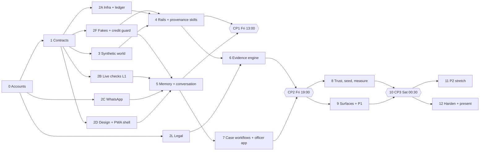

# Paytm Hisaab: build phases

Everything in [IMPLEMENTATION_PLAN.md](IMPLEMENTATION_PLAN.md), in the order it gets built.
Section references like **§6** point back to the plan, which holds the detail. This file only
covers sequence, ownership and when each phase counts as done.

**A = Ledger and skills** (Python, data, eval) · **B = Agent and surfaces** (n8n, Sarvam,
Cognee, WhatsApp, web)

**How to use this file**
- Tick a box when the task is merged and running in the shared stack (reachable through the
  tunnel), not when it only works in someone's editor.
- Put the task ID in commit messages, for example `feat(ledger): 2A.5 chain append and verify`.
- A phase is finished only when its **Done when** checks pass.
- **No credits during development.** Build and test against the local n8n and
  `services/fakes`. Sarvam, Twilio, hosted Cognee and n8n Cloud are touched only in the live
  windows L1–L5 (plan §16a), each with a budget. Tasks that spend credits are marked
  **(live)**.
- **Who owns what:** [LANES.md](LANES.md) gives every task and folder exactly one owner, lists
  the handoffs between the lanes, and gives each person an ordered queue. Where a phase here
  is shared, the task carries its owner as **(A)** or **(B)**.
- A **checkpoint** (CP) is a joint end-to-end test. Both lanes keep working while it runs;
  a failed checkpoint means fixing it before starting anything new.
- **Cut rule:** if a checkpoint slips, drop P1 items from the *end* of the Phase 9 list. Never
  cut P0, and never cut tests covering P0.

---

## Overview

| Phase | Name | Owner | When | Depends on | Priority |
|---|---|---|---|---|---|
| 0 | Accounts, access and repo | A + B | Thu, first 30 min | none | P0 |
| 1 | Contracts | A (1.1–1.3), B (1.4–1.7) | Thu, next 45 min | 0 | P0 |
| 2A | Infra and ledger core | A | Thu night | 1 | P0 |
| 2B | Live checks S1–S8 (window L1) | B | Thu night | 0, 1 | P0 |
| 2C | WhatsApp channel | B | Thu night | 0 | P0 |
| 2D | Design foundation and PWA shell | B | Thu night | 1 | P0 |
| 2F | Fakes, live switch and credit guard | A | Thu night | 1 | P0 |
| 2L | Legal verification | B | before A reaches 6.6 | 0 | P0 |
| 3 | Synthetic world v2 · **built and committed** (3.17–3.19 and 3.21 pending) | A | Thu night → Fri 10:00 | 1 | P0 |
| 4 | Rails, clock and provenance skills | A | Fri 08:00–13:00 | 2A, 3 | P0 |
| 5 | Memory and conversation loop | B | Fri 08:00–13:00 | 2B, 2C, 2D (and 4 as it lands) | P0 |
| **CP1** | **Ordinary Tuesday, end to end** | A + B (driver B) | **Fri 13:00** | 4, 5 | gate |
| 6 | Evidence engine | A | Fri 13:00–19:00 | 4, 2L | P0 |
| 7 | Case workflows and officer app | B | Fri 13:00–19:00 | 5 (and 6 as it lands) | P0 |
| **CP2** | **Freeze, end to end** | A + B (driver A) | **Fri 19:00** | 6, 7 | gate |
| 8 | Trust, seeding and measurement | A | Fri 19:00–00:30 | 6, 7 | P0 + P1 |
| 9 | Remaining surfaces and P1 features | B | Fri 19:00–00:30 | 7, 8 (partly) | P0 + P1 |
| **CP3** | **Phase 10: integration and deployment** | split per task | **Sat 00:30** | 8, 9 | gate |
| 11 | P2 stretch | split per task | only after CP3 | 10 | P2 |
| 12 | Harden and present | split per task | Sat 19 Sep | 10 | P0 |

**Critical path:** 0 → 1 → 2A (Caddy and core stubs) + 2F (fakes) → 4 → CP1 → 6 → CP2 → 8 (seed and
beats) → CP3 → 12. A delay on this path delays the demo. Anything off it can slip or be cut.

---

## Phase 0: Accounts, access and repo

**Owner:** A + B · **When:** Thu, first 30 min · **Refs:** §0, §4, §16, §22

- [x] **0.1** Redeem the n8n Cloud voucher. Record the plan tier, monthly execution cap,
      concurrency limit, instance version and public API access in `n8n/README.md`.
      → **Pro for a month: 10,000 executions, 20 concurrent, 7-day logs, public API
      included.** `pandemonium-research.app.n8n.cloud`; the API key works (checked 18 Sep)
      and expires 16 Dec. **n8n@2.39.7**; pin the local n8n to the same image.
- [x] **0.1b** Redeem the **Cognee hackathon credits** at platform.cognee.ai/billing, and note
      the API key, the credit balance and where it runs out.
      → **$45 at $1 per million tokens (about 45M tokens)**. Hosted API docs:
      `api.aws.cognee.ai/docs`, plus the tenant's own `/docs`. Check concurrency limits in S6.
- [x] **0.2** Add `N8N CREDITS .docx.pdf`, `.env`, `data/` and `design/reference/` to
      `.gitignore`.
- [x] **0.3** Get the Sarvam API key and check the credit balance. → **100 credits**. The cost
      per call is still to be measured in L1.
- [x] **0.4** Create the Twilio account, open the **WhatsApp sandbox**, and join both phones
      by sending `join <code>` to `+1 415 523 8886`. Note the code and the sandbox's inbound
      webhook setting. No Meta business portfolio or verification is involved.
      → **100 free messages, 98 left**. Inbound counts too, and a join costs 2. The §16a
      budgets now total 86.
- [x] **0.5** No server: install `cloudflared` and confirm
      `cloudflared tunnel --protocol http2 --url http://localhost:8080` gives a working
      `https://<random>.trycloudflare.com`. Disable laptop sleep and give Docker Desktop
      (WSL2) at least 8 GB.
      → **Use `--protocol http2`.** QUIC drops every few seconds behind ProtonVPN; HTTP/2
      served a test page through the tunnel on 18 Sep. Sleep on AC is already "never". The
      laptop has 32 GB, so WSL2's default of half is about 16 GB and needs no `.wslconfig`.
      Start Docker Desktop before 2A.
- [x] **0.6** Create a public `hisaab-anchors` GitHub repo and a fine-grained token for it.
      → `Pandemonium-Research/hisaab-anchors`, with the token in `.env.live`. No need to clone
      it, because core commits through the GitHub API.
- [x] **0.7** Create branch `bfi`. `git mv` the old tree into `archive/agent-labs-2026-09-12/`
      (`synth/`, `service/`, `tools/`, `phinite/`, `webchat/`, `data/reference/`, old docs,
      `render.yaml`, `requirements.txt`). Leave the new plan files and pitch sources at the
      root.
      → Also archived: the old README, `pitch/` (the Agent Labs deck), the old `.env.example`
      and its images. New root `README.md` and `.env.example` (everyday and live sections).

**Done when:** every account is set up and its keys are stored in `.env.live` (logging in is
free; the first paid calls happen in the L1 live checks, 2B), a joined phone has received the
sandbox's welcome message, a tunnel URL serves something from the laptop, and `bfi` is pushed.

---

## Phase 1: Contracts

**Owner:** A drafts 1.1–1.3, B drafts 1.4–1.7, then both sign off · **When:** Thu, 45 min ·
**Depends on:** 0 · **Refs:** §6, §7, §8, §10, §12, §14

These are frozen before anyone builds, so neither lane waits on the other.

- [x] **1.1** **(A)** Ledger entry kinds and their payload schemas (§6).
      → The 13 kinds, unchanged. `claim.answered` records the merchant's answer, not a label (D15).
- [x] **1.2** **(A)** Role matrix: role × endpoint × entry kinds each role may append (§14).
      → Seven roles: the plan's six plus `app` for the browser, which may append nothing (D10).
- [x] **1.3** **(A)** Endpoint list with request and response JSON, including `/app/*`,
      `/assistant/*`, `/config`, `/prompts/{name}` and `/sim/*` (§7), plus the cassette
      format for 2F.2, so the L1 recordings fit the fakes.
      → 50 operations on `/api/docs`, each with its query parameters declared: merchant screens
      require `?merchant=` (D28), and `as_of` defaults to the sim clock. Adds `/rails/debits`
      (D9) and B's three screens (D11, D12, D13). Cassette format in `app/schemas/cassette.py`.
- [ ] **1.4** **(B)** LLM output schemas: hard-case label, intent, notice extraction, grievance facts,
      CA and merchant explainers, handoff summary (§8).
- [ ] **1.5** **(B)** Workflow boundaries: WF IDs, triggers, inputs and outputs, which role key each
      uses, and the webhook payloads core sends to n8n (§10).
- [ ] **1.6** **(B)** Mapping from each screen (M0–M7, O1–O3) to its read model (§12).
- [ ] **1.7** **(B)** i18n key list: questions, warnings, refusals, case steps, button labels.

**Deliverables:** Pydantic models in `services/core/app/schemas/`, and the workflow table in
`n8n/README.md`, both committed.

**Done when:** both people have signed off. The OpenAPI page renders from the stubs in 2A.

---

## Phase 2: Foundations (parallel lanes, Thursday night)

### 2A: Infra and ledger core

**Owner:** A · **Depends on:** 1 · **Refs:** §4, §6, §7, §14, §16

- [x] **2A.1** `docker-compose.yml`: postgres (pgvector), core, memory placeholder, web, caddy,
      and the `local-n8n` profile, pinned to `n8nio/n8n:2.39.7`, the version on n8n Cloud.
      `tasks.py` with `up`, `migrate` and `test`.
      → `python tasks.py up` brings db, core, fakes and caddy up healthy from an empty volume.
      memory and web sit behind the `surfaces` profile until B's Dockerfiles land (D19). The db
      init is `.sql`, not `.sh`: the shell script failed from the bind mount and the extra
      databases were silently never created (D25). `migrate` is a placeholder until 2A.3.
- [x] **2A.2** Caddy in compose on :8080 routing one origin by path (`/api/*` → core, `/mem/*`
      → memory, everything else → web), and the free `cloudflared` quick tunnel (`--protocol http2`), which the
      phones need (HTTPS for the PWA and the microphone). The local n8n reaches core on the
      Docker network, so day-to-day development doesn't use the tunnel at all.
      `tasks.py publish` pushes a new hostname into core's config and, **in live windows
      only**, into the n8n Cloud workflows (public API) and the Twilio webhook.
      → Verified through a quick tunnel over http2: healthz, docs, and the 403s with their
      reasons all come back through Cloudflare with a valid certificate. `publish` writes the
      hostname to core's runtime config and contacts nothing else. **Gotcha:** a fresh
      `trycloudflare.com` name can fail to resolve on the laptop for a minute or more, because
      the first lookup caches NXDOMAIN; `dig @1.1.1.1 <host>` shows it is live. Phones on mobile
      data are unaffected.
- [ ] **2A.3** Alembic with separate owner and app DB roles. Tables for the `rails`, `ledger`
      and `ops` schemas (§6).
- [ ] **2A.4** `ledger.entries` and `ledger.chain_heads`. A `BEFORE UPDATE OR DELETE OR TRUNCATE`
      trigger. The app role gets `INSERT, SELECT` only.
- [ ] **2A.5** `ledger/chain.py`: canonical JSON, append under a row lock with `recorded_at`
      from `clock_timestamp()`, and `verify`.
- [ ] **2A.6** `auth.py`: role keys, the per-role check on entry kinds, 403s with a readable
      reason.
- [x] **2A.7** Stub endpoints for every route in 1.3, returning fixture JSON, reachable
      through the tunnel.
      → 49 contracted operations, each validating against its response model, behind role-key
      auth. Checked through the tunnel. The contract amendments D9–D15 are packet 2b.
- [ ] **2A.8** Tests: hashing is deterministic, the trigger blocks update/delete/truncate,
      verify catches a one-byte edit at the right index, a wrong key gets 403.

### 2B: Live checks S1–S8 (live window L1, go/no-go on each)

**Owner:** B · **Depends on:** 0, 1 · **Refs:** §17 spike table, §8, §9, §10.2, §16a

**(live)** These are the only paid calls before CP3. Each check makes one or two real calls
within the L1 budget, runs with `--record` so the responses become cassettes for the fakes, and
stops. The i18n templates get their one batched translation here too.

Record each result, and the fallback chosen if one failed, under "Spike results" in
`n8n/README.md`.

- [ ] **S1** `sarvam-105b` tool calling and JSON-schema output, in Kannada and English.
- [ ] **S2** Saaras v3 on a real WhatsApp OGG voice note in Kannada (with ffmpeg → WAV if
      needed).
- [ ] **S3** Bulbul v3 audio sent back as a WhatsApp voice note.
- [ ] **S4** Sarvam Vision on a specimen notice photo.
- [ ] **S5** An n8n Cloud OpenAI-compatible credential pointed at Sarvam, driving the AI Agent
      node and the Structured Output Parser.
- [ ] **S6** Cognee v1.x `remember`/`recall` **against the hosted platform using the hackathon
      credits**, and the self-hosted path (Sarvam as the LLM, fastembed, pgvector) as the
      fallback. Both behind our memory service, switched by `MEMORY_BACKEND`. Pin the version.
- [ ] **S7** An n8n Cloud Wait node resumed by a call made through core.
- [ ] **S8** n8n Cloud → core stubs **through the tunnel** using role keys; export, import and
      base-URL rewrite through the public API (`tasks.py publish`); **count the executions one
      fake beat uses**.

### 2C: WhatsApp channel

**Owner:** B · **Depends on:** 0, 2F · **Refs:** §11, §16a

Built against the Twilio-shaped fakes (2F) and the local n8n. The one real round trip (2C.2
and 2C.3) is part of live window L1 and is recorded as cassettes.

- [ ] **2C.1** WF31's Webhook node with the `X-Twilio-Signature` check, tested with
      `tasks.py fake-wa`. In L1, point the sandbox's "when a message comes in" webhook at the
      n8n Cloud webhook URL.
- [ ] **2C.2** **(live, L1)** Round trip: a message from a joined phone reaches n8n and gets a reply through
      the Twilio node from `whatsapp:+14155238886`.
- [ ] **2C.3** **(live, L1)** Fetch inbound media (voice note, notice photo) from the Twilio media URL with the
      account SID and auth token; confirm the formats and store with a sha256.
- [x] **2C.4** Agree the **numbered-reply format** for this channel (the sandbox has no tap
      buttons): "1 sale · 2 family · 3 my own money · 4 not sure", parsed from a digit, a word
      in any supported language, or a voice note. Add a Wait between messages for the
      one-per-three-seconds limit.
      → **Agreed 18 Sep (D24).** The app's M2 chips add "loan / other"; voice and free text
      reach all 7 `AnswerChoice` values. Coverage measured on eval and dev: the 4 numbered
      options fit 90.5% of truthful answers (see Decisions in `n8n/README.md`).

### 2D: Design foundation and PWA shell

**Owner:** B · **Depends on:** 1 · **Refs:** §12, §12.1

- [ ] **2D.1** Capture 8–10 Paytm for Business screenshots into `design/reference/`
      (gitignored).
- [ ] **2D.2** `design/tokens.ts` generating the Tailwind theme. Fonts: Inter plus the Noto
      Indic families, self-hosted (no font CDN at runtime).
- [ ] **2D.3** Base components: `PhoneFrame`, `AppBar`, `BottomNav`, `HeaderBand`, `Card`,
      `Chip`/`ChipGroup`, `StickyCTA`, `BottomSheet`, `AmountText`.
- [ ] **2D.4** `vite-plugin-pwa`: manifest, standalone display, theme colour, icons, offline
      shell.
- [ ] **2D.5** Serve it through Caddy and the tunnel, and install it on one Android phone.

### 2F: Fakes, live switch and credit guard

**Owner:** A (Phase 3 is already done, so A has the time) · **Depends on:** 1 · **Refs:** §16a

- [ ] **2F.1** `services/fakes`: Sarvam-shaped endpoints (chat completions with tool calls,
      STT, TTS, translate, Vision) and Twilio-shaped endpoints (Messages API, media URLs, status
      callbacks), in compose by default.
      → **Part done (the H3 subset).** Twilio Messages API, media URLs and status callbacks, and
      Sarvam chat completions with tool calls and JSON-schema output, all deterministic and
      keyed like the real APIs, on `:8200` in compose. STT, TTS, translation and Vision are the
      rest, and they replay L1 cassettes that do not exist yet (needs H5). The cassette lookup
      seam is in place, marked `TODO(2F.2)`.
- [ ] **2F.2** Record and replay: `--record` in a live window writes cassettes to
      `services/fakes/cassettes/<provider>/`, keyed by a hash of the normalised request. Replay
      first, deterministic rules second.
- [ ] **2F.3** The `HISAAB_LIVE` switch in every provider client and the memory service. Real
      keys only in `.env.live`, loaded only by `tasks.py --live`. Core's clients are A's; the
      memory service's switch is B's, in 5.1.
- [ ] **2F.4** Network guard: pytest blocks non-local sockets. The web half (Playwright
      blocking external requests, self-hosted fonts) is B's, in 9.3 and 2D.2.
- [ ] **2F.5** `ops.provider_usage` and `tasks.py usage`: spend per provider per window,
      against the §16a budgets.
- [x] **2F.6** `tasks.py fake-wa "<text or file>"` posts a signed inbound WhatsApp message to
      the local n8n; the fakes' outbox page shows what WF30 sent.
      → Text and media both send. The signature is Twilio's real HMAC-SHA1 scheme, asserted in
      the tests against Twilio's published vector, and checked here against a validator written
      separately from the sending code, which is what B's 2C.1 check has to agree with. A file
      argument is served from the fake media URL: 401 unauthenticated, correct content type, and
      the bytes round-trip with a matching sha256. `FAKE_WA_WEBHOOK_URL` overrides the target.

**Done when:** the whole stack runs a full nightly pass and a freeze case with `HISAAB_LIVE=0`,
`tasks.py test` passes with the network guard on, and `tasks.py usage` reads zero.

### 2L: Legal verification (before A reaches 6.6)

**Owner:** B · **Unblocks:** A's 6.6 and 6.7 (handoff H9) · **Refs:** §22

Unverified citations block approval, so this must be done before CP2.

- [x] **2L.1** MHA/I4C SOP (2 Jan 2026), from a primary or legal source: lien-only default,
      ₹50,000 limit, mule vs bona fide receiver.
      → **The SOP text is not public.** Its existence, date and scope are confirmed by PIB
      (28 Jul 2026, Release ID 2290377) and by the Rajasthan HC, which applies its Clause 10.
      Lien-limited-to-the-disputed-sum and the ₹50,000 / 90-day rule rest on one legal source
      (LiveLaw). **Mule vs bona fide receiver is NOT in any source describing the SOP**, so it is
      `verified: false`; the courts draw that line instead. The deck's "if the trail is verified"
      qualifier is unsourced — see `deck_v2_corrections` in `legal/citations.yaml`.
- [x] **2L.2** AP High Court (July 2026) and Rajasthan HC, *Balaji Enterprises v RBI* (Aug 2026):
      exact citations and holdings.
      → *Sri Sai Wines v. Union of India*, WP 969/2026, **decided 22 Jun 2026** (not July)
      [2026 SCC OnLine AP 2469]. *Shree Balaji Enterprises v. RBI*, S.B. CWP 2679/2026,
      **pronounced 20 Aug 2026** [2026:RJ-JP:33344] — 77-page judgment read in full; para 28 and
      direction (C) quoted verbatim; 105 petitions disposed of together. Added
      *Ritesh Yadav v. RBI* (Allahabad HC, DB, 14 Aug 2026) for the lien-limit principle.
- [x] **2L.3** CGST s.2(6), s.22, s.23 and s.25 wording; the 30-day registration window.
      → Verbatim from the CBIC repository. **s.22(1) says ₹20 lakh**; the ₹40 lakh figure is its
      third proviso plus **Notification 10/2019-CT** (goods-only, ten States excluded — Karnataka
      and UP are not among them, so ₹40L holds for both demo merchants).
- [x] **2L.4** Write `legal/citations.yaml` with source URLs and `verified` flags.
      → 10 citations, 8 with primary text read. The file defines the schema the 6.6 guard reads.
      → **H9 is complete: A is unblocked for 6.6 and 6.7.**
- [x] **2L.5** A freeze scale figure (NCRP/I4C volumes or petition counts), or record that
      none was found. Never invent one.
      → **No official count of frozen or lien-marked accounts exists**; none is claimed. Verified
      proxies (PIB, as on 30 Jun 2026): ₹11,158 crore saved across 32.80 lakh CFCFRMS complaints;
      32.08 lakh accounts *flagged* Layer-1 (flagged is not frozen); plus 105 petitions in one
      Rajasthan batch.

**Phase 2 done when:**
- S8 passes: n8n Cloud reaches the stubs with a role key, and a wrong key gets 403.
- Ledger tests are green in the stack behind the tunnel.
- The PWA shell is installed on a phone.
- The numbered-reply format is agreed (2C.4).
- Every spike has a recorded go/no-go.

---

## Phase 3: Synthetic world v2

**Owner:** A · **When:** Thu night → Fri 10:00 · **Depends on:** 1 · **Refs:** §5, §15

> **Status, 18 Sep 2026: built, verified locally and committed on `main` (3.16).**
> - All four splits generate in about 30 s, pass validation, and are byte-identical across runs.
> - Phase 3 has nothing to deploy until 2A and 4 load the data, so a tick here means "built and
>   verified locally".
>
> Run it with `python -m sim.generate [--only demo]`. The schema and the demo answer key are
> documented in [sim/README.md](sim/README.md).

### Done

- [x] **3.1** `sim/catalog.py`:
      - 6 shop types plus 2 demo shops
      - 41 items → HSN → exempt, with the legal basis
      - six regions and languages (kn, hi, ta, te, mr, bn)
      - FY 2025-26 festivals, fictional lenders, chit funds, insurers and tax offices
- [x] **3.2** `sim/world.py`:
      - sales with baskets and POS bills; genuine same-basket repeat purchases (hard negatives)
      - double payments with refunds, including the wrong twin
      - family money, loans, chit, gifts, hand loans, deposits and insurance
      - month-start top-ups, the fraud chain, the difficulty knob
      - a time-ordered **ledger pass**: supplier payments with occasional stock-ups, top-ups
        from own accounts when short, supplier refunds, failed-payout reversals, Sunday sweeps
- [x] **3.3** `visible/terminals.json` (device id, model, install date, geo) and
      `visible/daily_balances.csv` (opening, credits, debits, closing). The merchant's account
      is modelled as the settlement account (`settlement_account` in `merchants.json`), so there
      are no separate settlement payout rows.
- [x] **3.4** `visible/rails_events.json`:
      - `lien_marked`
      - `payment_declined`: every debit after the lien, with two retries; credits keep landing
      - `lea_inquiry`, with a do-not-disclose instruction
      - `notice_served`, pointing at the document only
      - `return_filed` (CMP-08) for composition dealers
- [x] **3.5** Merchant behaviour:
      - `hidden/merchant_answers.csv` records what the merchant would answer about every
        credit: responds or not, the tap answer, delay, voice/tap/text, a later correction and
        its lag
      - `hidden/behaviour.json` holds the model's rates
      - Annotations added after a notice exist only as parameters (count range, truthful
        share). The harness in 8.3 must generate them.
- [x] **3.6** `sim/scenario.py` pins Sahana Stores and **asserts on every run**:
      - ✓ exactly 3 question-worthy credits on 8–9 Mar: own savings ₹15,000, spouse ₹7,500 by
        QR, Raghu Shetty ₹4,850 (with 2 earlier purchases)
      - ✓ no other non-sale credits, direct-to-VPA sales or large unbilled sales on those days
      - ✓ the ₹23 payment from a first-time payer
      - ✓ the ₹40L crossing on **14 Mar 2026**, and registration required
      - ✓ ₹4,200 at 19:47 on 21 Mar on POS01, with a bill, paid by a downstream mule
      - ✓ the ₹4,200 decoy on 18 Mar from a regular (8+ earlier purchases); these are the only
        two ₹4,200 credits from 14 to 28 Mar
      - ✓ **339 credits** in the 7 days before the 09:30 lien on 24 Mar
      - ✓ 3+ declined debits starting 09:41
      - ✓ a police inquiry on 11 Feb about a ₹1,850 sale
      - The notice (20 Aug 2026) claims every credit as turnover: **₹53,16,632, not the ₹60.98L
        in deck v2**. The claim isn't pinned; see 3.19.
- [x] **3.7** Maurya Sabzi Bhandar (`MID_DEMO_LKO`, Lucknow, Hindi):
      - aggregate turnover ₹46,00,838, all exempt; crosses ₹40L on 17 Feb
      - asserted: registration not required
      - notice (26 Aug 2026) claims ₹53,81,515
- [x] **3.8** `sim/notices.py`:
      - SPECIMEN notice PDF using only the standard library (Helvetica, one A4 page)
      - a rotated, unevenly lit phone photo JPG (needs Pillow; skipped without it)
      - both watermarked SYNTHETIC SPECIMEN
- [x] **3.9** `sim/generate.py`:
      - demo, dev, eval and sweep splits, `visible/` and `hidden/`, fixed seeds
      - chronological IDs and 12-digit UTRs across each split
      - `manifest.json` for every split
      - (The `tasks.py` wrapper is still pending: 3.17.)
- [x] **3.10** `eval/baseline.py` (rules only, strictly prior payer history) and `eval/score.py`
      (the §15 metrics, per-merchant turnover error, registration-answer flips, `--json`).

**Added during the build**

- [x] **3.11** `sim/validate.py` runs after every generation, and standalone:
      - IDs and UTRs unique; bills add up; references resolve
      - balances add up and never go negative
      - turnover and crossing dates recomputed from disk
      - events consistent; no successful debit after a lien
      - no hidden vocabulary in `visible/`
- [x] **3.12** Calibrated turnover targets for dev and eval:
      - family kiranas sit **just under ₹40L** while ₹47–50L comes in
      - vegetable vendors are just over ₹40L but exempt
      - darshinis cross the ₹20L services line
- [x] **3.13** `hidden/notices_truth.json` (the fields printed on each notice, for the OCR check
      in B4) and `visible/hsn_catalog.json` in every split.
- [x] **3.14** Realism fix found by the scorer: strangers can no longer share the owner's exact
      name (own-account precision went from 0.17 to 1.0), and names now vary more.
- [x] **3.15** `sim/README.md`: commands, splits, full schema, labels, how a year is made, the
      demo answer key, changes from v1, caveats. Old v1 splits moved to `data/_v1/`
      (gitignored); old `synth/` is untouched.

### Measured so far (rules-only baseline, eval split)

| Metric | Result |
|---|---|
| Sale vs not-a-sale (exact type for non-sales) | 97.7% |
| Non-sale credits labelled correctly | **56.3%** (n = 1,151) |
| Non-sale credits counted as sales | 15.0% |
| Confidently wrong on non-sale credits | 16.0% |
| Exempt vs taxable | POS-billed 100%, QR-only 79.8% |
| Registration answer | **flips for EV_004**: truly under ₹40L, counted as over |

This is the floor the agent has to beat. It's lower than v1's 77.8% because refunds now arrive
up to a day later and more family money comes by QR.

### Still pending

- [x] **3.16** Commit `sim/` and `eval/` (`db5c16b`, `cb47fe0`).
- [x] **3.17** Wire `tasks.py generate` to `python -m sim.generate` (lands with 2A.1).
      → Passes `--only`, `--out` and `--force` through. `sim.generate` refuses to overwrite a
      split it did not write, so the current `data/demo` (no manifest) needs `--force`.
- [ ] **3.18** Grep test proving nothing under `services/` or `n8n/` reads `hidden/` (add with
      2A.8; `services/` doesn't exist yet).
- [ ] **3.19** Decide the deck figures. The data now gives a ₹53.17L notice claim (deck v2 says
      ₹60.98L) and 68 credits on 8–9 Mar (deck v2 says 39). **Recommended:** update deck v2
      from measured data in 12.6, rather than calibrating the data to old numbers. The Round 1
      figures (₹4,200, 339, 14 Mar) already hold.
- [x] **3.20** Point the tracked v1 docs at v2: `data/README.md` now points at `sim/README.md`,
      and `DATA.md` moved to the archive with 0.7.
- [ ] **3.21** Run the baseline on dev, and on sweep for the accuracy-vs-difficulty curve. Only
      eval has been scored so far. (P1)

**Tracked in later phases**
- Annotations after a notice, generated from `behaviour.json` by the simulated-merchant harness
  → **8.3**.
- The "exactly 3 questions on 10 Mar" check against the real ask rules and question budget →
  **4.12**. The data enforces the conditions, but only the skill can prove it.
- The OCR check of the notice photo against `notices_truth.json` → **B4 in 8.7**.
- A `fabricated_history` merchant for the tier-shape demo → **11.1** (P2).

**Done when:**
- ✅ `python -m sim.generate --only demo` passes every scenario assertion (`tasks.py` wrapper
  pending, 3.17).
- ✅ The baseline has been scored on eval.
- ⏳ A grep test proves nothing under `services/` reads `hidden/` (3.18).

---

## Phase 4: Rails, clock and provenance skills

**Owner:** A · **When:** Fri 08:00–13:00 · **Depends on:** 2A, 3 · **Refs:** §6, §7, §13, §21

Each item replaces its stub in the running stack as soon as it lands.

- [ ] **4.1** `clock.py` (`sim_now`), `POST /sim/clock`.
- [ ] **4.2** `POST /rails/credits|bills|events` and `POST /sim/replay`, with an optional
      real-time factor.
- [ ] **4.3** SQL function `ledger.current_view(merchant, as_of)`: machine label, claim label,
      effective label, conflict flag and entry refs. The tier column comes in 6.1.
- [ ] **4.4** `payer_history`, counting **strictly prior** payments only.
- [ ] **4.5** `classify_rules`, with the §21 fixes (duplicates, strictly-prior counts).
- [ ] **4.6** `POST /ledger/proposals`: enum check, agent confidence capped at 0.85.
- [ ] **4.7** `question_budget` and `POST /skills/select-questions` (≤3 a day, priority,
      7-day expiry, `payer_facts` skip).
- [ ] **4.8** `POST /ledger/questions` and `POST /ledger/claims`, which also update
      `payer_facts`.
- [ ] **4.9** Guards needed by replies: `numbers` (lakh/crore, Indic digits) and `language`.
- [ ] **4.10** `GET /prompts/{name}` and `GET /config`.
- [ ] **4.11** Read models `/app/home`, plus `/assistant/inbound|stream|outbound`: SSE, with
      inbound forwarded to the WF31 webhook along with `N8N_WEBHOOK_SECRET`.
- [ ] **4.12** Tests: 10 Mar selects exactly the 3 seeded credits; the ₹23 payment is never
      asked about; no data after `as_of` leaks through; rules golden cases.

**Done when:** 4.12 is green in the running stack, and B's workflows call real endpoints for everything
in this phase.

---

## Phase 5: Memory and conversation loop

**Owner:** B · **When:** Fri 08:00–13:00 · **Depends on:** 2B, 2C, 2D (and 4 as it lands) ·
**Refs:** §8, §9, §10, §11, §12.2

- [ ] **5.1** `services/memory`: Cognee wrapper (`/remember`, `/recall`, `/improve`,
      `/forget`) with `MEMORY_BACKEND=hosted|self|stub` and the `degraded: true` fallback.
      Development uses `stub`, or `self` with its LLM pointed at the fakes; `hosted` (the
      credits) is used only in live windows.
- [ ] **5.2** Local n8n credentials, all pointing at the fakes: one HTTP Header Auth per role,
      plus Sarvam and Twilio base URLs. The n8n Cloud credentials are created only in L2 (10.1b).
- [ ] **5.3** Prompts v1: `classify_hard_case`, `intent`, `reply_style` (with version
      headers).
- [ ] **5.4** i18n files `i18n/*.json`, from the one batched Sarvam-Translate run in L1 (replayed
      from its cassette after that). A person reviews Kannada
      and Hindi.
- [ ] **5.5** **WF30 merchant-outbound**: numbered-reply messages to Twilio through an HTTP
      Request node with a configurable base URL (the fakes in development), one message every
      three seconds, and `/assistant/outbound` for the app.
- [ ] **5.6** **WF31 merchant-inbound**:
      - starts from a Webhook node with the `X-Twilio-Signature` check
      - normalise the message; voice goes to Saaras; app button taps and WhatsApp numbered
        replies skip the LLM
      - the intent comes from the AI Agent node, whose tools are HTTP Request Tools
      - answers are written to `/ledger/claims`
      - the reply runs through the guards, then memory `remember`
- [ ] **5.7** **WF10 nightly-provenance**, in live and seed modes:
      - Loop Over Items batching
      - hard-case agent with memory recall, then proposals
      - `select-questions`, then WF30
      - memory `improve`
- [ ] **5.8** Screens **M0** Language and consent, **M1** Home, **M2** Confirm payments, **M6**
      Assistant.

### ✅ CP1: Ordinary Tuesday (driver B; Fri 13:00 in the original schedule)

- [ ] Jump the clock to 10 Mar 02:00 and run WF10 on the local n8n against the fakes
      (no credits).
- [ ] 3 Kannada questions arrive in the fakes' WhatsApp outbox **and** in M2 on the installed
      PWA.
- [ ] Two taps and one voice answer produce `claim.answered` entries. The machine labels are
      still present in `current_view`.
- [ ] Memory recall returns the spouse relationship. A later credit from that payer isn't
      asked about.

---

## Phase 6: Evidence engine

**Owner:** A · **When:** Fri 13:00–19:00 · **Depends on:** 4, 2L · **Refs:** §6 tiers, §7,
§14, §2 (lines we won't cross)

- [ ] **6.1** Tiers in `current_view`, plus `POST /skills/tiers` returning ₹ and count per tier
      and the shape figure.
- [ ] **6.2** `POST /skills/turnover`: apportionment by value for unbilled QR sales, excluded
      buckets with txn IDs, coverage, workings.
- [ ] **6.3** `POST /skills/threshold`: aware of `gst_status`; projected date and days of
      warning; exclusively-exempt verdict.
- [ ] **6.4** `POST /skills/isolate`: matching by UTR **and independently** by amount and date;
      same-amount candidates; bill, device and geo; the 7-day count.
- [ ] **6.5** `POST /skills/escalation-check`, with the rules and thresholds read from config.
- [ ] **6.6** Guards: `citations` (the allowlist; unverified entries block approval),
      `no-innocence`, `extraction`.
- [ ] **6.7** Grievance template filled from `legal/citations.yaml`.
- [ ] **6.8** `POST /cases` and `POST /packs`: pack JSON and PDF (WeasyPrint, Noto Indic
      fonts, SIMULATED and prototype stamps), then `pack.built`.
- [ ] **6.9** Freeze detector: a lien, or declines followed by a lien, opens `case.opened` and
      fires the n8n webhook.
- [ ] **6.10** Approvals: the `resume_url` is stored; `/packs/{id}/approve|reject` appends an
      entry and resumes the Wait; `/outbox/{pack}/send` refuses without `pack.approved`, then
      appends `pack.sent`.
- [ ] **6.11** Read models `/app/cases`, `/app/turnover`, `/app/officer/queue` and
      `/app/officer/cases/{id}`.
- [ ] **6.12** Tests against the demo answer key:
      - turnover within target; crossing date; isolation plus decoy
      - the guards
      - the outbox refusing an unapproved pack

**Done when:** 6.12 is green in the running stack.

---

## Phase 7: Case workflows and officer app

**Owner:** B · **When:** Fri 13:00–19:00 · **Depends on:** 5 (and 6 as it lands) · **Refs:**
§10, §10.1, §12.2, §12.3

- [ ] **7.1** **WF50 escalation-handoff** (sub-workflow).
- [ ] **7.2** **WF90 error-handler**, set as the error workflow on every workflow.
- [ ] **7.3** Prompts: `notice_extract`, `grievance_facts`, `ca_explainer`, `handoff_summary`.
- [ ] **7.4** **WF20 freeze-response**:
      - isolate → tiers → escalation → grievance → pack
      - acknowledge the merchant
      - **Wait, resumed by webhook** → outbox, or WF50
- [ ] **7.5** **WF40 notice-response**:
      - Sarvam Vision → extraction → guard → turnover, threshold and tiers → pack
      - explainers → Wait → deliver
      - fallback: the notice is chosen from events
- [ ] **7.6** Add the threshold warning to WF10 (beat B3).
- [ ] **7.7** Screen **M5** Case tracker, with freeze and tax variants.
- [ ] **7.8** Screens **O1** Queue and **O2** Case, with the sticky "Approve and send" bar → core
      approve → Wait resumes.

### ✅ CP2: Freeze (driver A; Fri 19:00 in the original schedule)

- [ ] Start the declines and the lien: a case opens automatically and WF20 runs on the local
      n8n against the fakes (no credits).
- [ ] Isolation shows "UTR ✓" and "Amount + date ✓". The decoy is listed and not chosen.
- [ ] A pack PDF exists with a bill and tiers. The grievance passes every guard, with verified
      citations only.
- [ ] The officer approves **on a phone**: the Wait resumes, the outbox gets it, and
      `pack.sent` is appended.
- [ ] M5 advances on the merchant's phone.
- [ ] WF40 runs once with the specimen photo through the fake Vision (the L1 cassette), and the verdict says "must
      register".

---

## Phase 8: Trust, seeding and measurement

**Owner:** A · **When:** Fri 19:00–00:30 · **Depends on:** 6, 7 · **Refs:** §6 anchoring,
§13, §14, §15

In order. 8.4 (anchors) and 8.8 (eval split run) are P1; everything else here is P0. If
time is short, skip 8.4 and come back to it after 8.7.

- [ ] **8.1** Permission matrix tests: every role against every mutating endpoint.
- [ ] **8.2** `POST /sim/tamper` for both variants (app-level update refused; superuser edit),
      plus `GET /ledger/verify` naming `broken_at`.
- [ ] **8.3** `eval/simulate_merchant.py`, driven by the hidden behaviour model.
- [ ] **8.4** `POST /anchors/run`: digest → OpenTimestamps receipt → git commit →
      `anchor.created`; verify checks entries against the anchors. Anchors created during
      seeding are labelled `simulated`.
- [ ] **8.5** **Seed:** replay the year through WF10 seed mode on the **local n8n** against the
      local core and the fakes, then `pg_dump` the snapshot. The final demo seed runs live
      once, in L2 (10.1b).
- [ ] **8.6** `tasks.py reset`: restore the snapshot, set the clock, clear the bus, in under
      60 s.
- [ ] **8.7** `eval/beats.py`, covering B1–B7.
- [ ] **8.8** **(live, window L3, optional)** `eval/agent_eval.py` (about 500 stratified hard
      cases; wired and tested on the fakes first), then `eval/report.py` →
      `eval/report.json`.
- [ ] **8.9** **(B)** Web pages `/ledger/:id` and `/eval`, built from the shared components.

**Done when:**
- The seed report shows ≤3 questions every day and zero credits without an entry.
- `verify` returns ok.
- `beats` B1–B7 are green on the local n8n and the fakes (no credits).

---

## Phase 9: Remaining surfaces and P1 features

**Owner:** B · **When:** Fri 19:00–00:30 · **Depends on:** 7 (8.4 for WF60) · **Refs:** §2,
§10, §12, §15

Work top to bottom. **The P0 block comes first.** The P1 block is in priority order: if time
runs out, cut from the bottom.

**P0**
- [ ] **9.1** `/demo` remote: jump-to presets, run nightly, declines and lien, specimen notice
      upload, police inquiry, tamper a/b, refusal probe, reset, health dots.
- [ ] **9.2** **WF99 refusal-probe** (the evidence key hitting `/ledger/claims` gets a 403), and
      the `hide_income` fixed refusal in WF31.
- [ ] **9.3** Playwright suite at 412 px and 360 px, in Kannada and English, covering M1, M2, M5
      and O2 (B8).

**P1, in priority order** (Vision OCR is already done in 7.5)
- [ ] **9.4** **M3** Payments and **M4** Payment detail.
- [ ] **9.5** `/stage`: two synced phone frames and the n8n execution strip.
- [ ] **9.6** Bulbul voice replies and a read-aloud button on M2 and M5.
- [ ] **9.7** **WF60 daily-anchor** (Schedule 23:55 IST → `/anchors/run`); needs 8.4.
- [ ] **9.8** **M7** Turnover and Share with CA (Web Share API); **O3** Sent and outcomes.
- [ ] **9.9** **WF10-eval** (wired on the fakes; the real run is part of L3): an n8n Data Table of
      about 50 labelled hard cases, run through the
      Evaluation node.
- [ ] **9.10** The Hindi merchant end to end: WhatsApp and app, and the exclusively-exempt
      verdict.
- [ ] **9.11** **WF21 lea-inquiry**, with no WF30 node. The test proving the merchant gets no
      message is `beats` check B6 (A, 8.7).
- [ ] **9.12** Web Push for alerts and approval requests: **9.12a (A)** subscribe and send in
      core; **9.12b (B)** service worker and UI.
- [ ] **9.13** Export every workflow to git (`tasks.py export-n8n --target local`).

(A's 8.8, the eval split run, is the last P1 item overall.)

---

## Phase 10: Integration and deployment (CP3)

**Owner:** split per task · **Driver:** A · **When:** Sat 00:30 · **Depends on:** 8, 9 ·
**Refs:** §16, §20

- [ ] **10.1** **(A)** `tasks.py beats`: B1–B8 green on the local n8n and the fakes first (free).
- [ ] **10.1b** **(live, window L2)** **(B)** Import the workflows into n8n Cloud and create
      its live credentials. **(A)** Start the tunnel and run `tasks.py publish`; run `tasks.py beats --live`
      **once**; re-run the demo seed live and snapshot it; check `tasks.py usage` against the L2
      budget.
- [ ] **10.2** **(B)** `tasks.py e2e` green on both viewports.
- [ ] **10.3** **(A)** Take a fresh seed snapshot, then `reset` and run `beats` again.
- [ ] **10.4** **(B)** Import the workflows and credentials into the local n8n, run `beats` once, and
      rehearse the offline switch: `N8N_BASE_URL` to local, `MEMORY_BACKEND=self`, the app on
      `http://localhost` (under 5 min).
- [ ] **10.4b** **(A)** **(live, inside L2)** Rehearse a tunnel restart: new hostname → `tasks.py publish` → WhatsApp and the
      phones work again, in about 30 s.
- [ ] **10.5** **(A)** Read live spend per provider from `tasks.py usage` and set the L4 and L5
      budgets.
- [ ] **10.6** **(B)** Export the workflows to git and tag `cp3`.

### ✅ CP3: all of 10.1–10.6 checked

---

## Phase 11: P2 stretch (only after CP3 is green, and never on Saturday)

**Owner:** 11.1, 11.5 and 11.6 are A's; 11.2, 11.3 and 11.4 are B's · **Refs:** §2 P2

- [ ] **11.1** A `fabricated_history` merchant in eval, plus the tier-shape metric in
      `report.json`.
- [ ] **11.2** Outcome metrics tiles on O3 (days to release, balance kept usable).
- [ ] **11.3** A QR code that opens a read-only merchant app on judges' phones.
- [ ] **11.4** An n8n Insights screenshot for time saved.
- [ ] **11.5** Nightly run at scale over the dev split (7 merchants).
- [ ] **11.6** GitHub Actions CI running `test` and `e2e`.

---

## Phase 12: Harden and present (Sat 19 Sep)

**Owner:** split per task · **Depends on:** 10 · **Refs:** §17, §19, §20, §22

Saturday is fix-only. No new features.

**Morning**
- [ ] **12.1** **(A)** `reset` then `beats` on the local n8n and the fakes, and again in offline mode
      (`MEMORY_BACKEND=self`). The live run is rehearsal 3 (12.2, window L4).
- [ ] **12.2** **(both)** Three timed rehearsals of the §19 run of show; the first two on the local n8n and
      the fakes, **only the third live (window L4)**. Two real phones, `/demo` on a
      third, `/stage` on the projector.
- [ ] **12.3** **(B)** UI polish pass against the reference screenshots: spacing, type sizes, Kannada
      line breaks.
- [ ] **12.4** **(A)** Record the fallback video of every beat.
- [ ] **12.5** **(A)** `tasks.py usage`: live spend so far against the L4 and L5 budgets. Check the
      remaining n8n Cloud executions against the budget from 10.5, and the
      remaining Cognee credits and Twilio trial balance.

**Midday**
- [ ] **12.6** **(A)** Update the deck and README with **measured** numbers from `eval/report.json`,
      replacing every target.
- [ ] **12.7** **(B)** Final pass on the §22 checks. Every citation in the demo pack is marked
      `verified: true`.
- [ ] **12.8** **(B)** Prepare whatever the Best Use of n8n prize asks for (workflow exports,
      screenshots, a short write-up).
- [ ] **12.9** **(A)** Tag `demo-final`, then merge `bfi` into `main`, so the repo's default
      branch shows the build.

**Before judging**
- [ ] **12.10** **(both)** Feature freeze 2 hours before judging.
- [ ] **12.11** **(A)** `reset`, then warm up: one nightly run and one Sarvam call (counted in L5).
- [ ] **12.12** **(B)** Phones charged. Check the **Twilio sandbox join** is still active: it lasts three
      days, and the phones joined on 18 Sep. Re-join only if it has lapsed, because each join
      costs 2 of the 98 messages. **(A)** Hotspot ready, laptop on charger with sleep disabled, tunnel up and
      `tasks.py publish` run once more.
