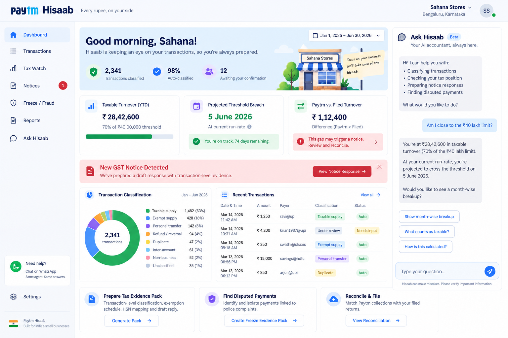
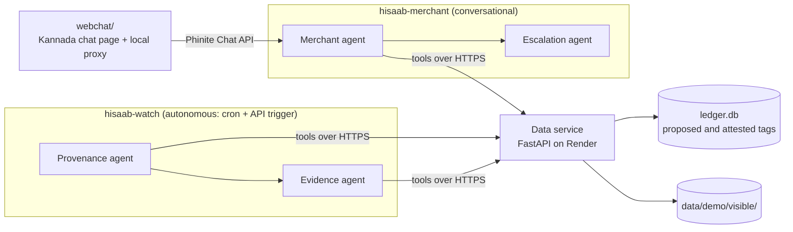

# Paytm Hisaab

**Every rupee, on your side.**

Hisaab is an agent system that helps a small Paytm merchant explain their own money when an
authority asks. Two authorities do ask. A cyber-crime unit can freeze the account over one
payment in hundreds. A GST notice can treat every UPI credit as income.

It keeps a **provenance ledger**: every incoming credit gets a label saying what it actually
was. Rules settle the routine sales, and an agent proposes a label for the ambiguous ones. The
merchant confirms with one tap, in Kannada. Two outputs come from that same ledger: a
**freeze evidence pack** that finds the one disputed payment, and a **tax evidence pack** that
works out real turnover.

> Built for the **Agent Labs Buildathon** (Phinite × Paytm, Track 2: AI for Small Businesses,
> Bengaluru, 12 September 2026). All data is synthetic, and every person, business and case
> reference in it is fictional.



<sub>This is a design mock of the product we're working towards, and its figures are made up.
What is actually built and running today is the chat, the tools, the data service and the
ledger.</sub>

---

## Contents

- [The problem](#the-problem)
- [How it works](#how-it-works)
- [Results](#results)
- [Architecture](#architecture)
- [Repository layout](#repository-layout)
- [Quickstart](#quickstart)
- [Synthetic data](#synthetic-data)
- [Data service API](#data-service-api)
- [Phinite tools](#phinite-tools)
- [Web chat](#web-chat)
- [Deployment](#deployment)
- [The demo: four beats](#the-demo-four-beats)
- [The lines we do not cross](#the-lines-we-do-not-cross)
- [Status and known gaps](#status-and-known-gaps)
- [Configuration reference](#configuration-reference)
- [Pitch deck](#pitch-deck)
- [Further reading](#further-reading)

---

## The problem

Two authorities now read a merchant's payment trail and draw adverse conclusions from it.

- **Police.** Fraud money passes through several accounts within minutes. The shop at the end
  of the chain, which just sold someone 12 kg of onions, can be lien-marked or frozen. The
  shop isn't named in the FIR, which is often filed in another state, and the owner usually
  finds out when a payment declines. With hundreds of payments a week, they can't tell which
  one is disputed.
- **Tax.** Authorities compare UPI collections against filed returns and send notices for the
  difference. In the 2025 Karnataka episode, a vegetable vendor selling exempt goods got a
  ₹29 lakh demand. It was withdrawn for traders who could *show* what they sold, and most
  couldn't. Notices about "differences in turnover" and "exemption claims" were still going
  out in August 2026.

Both authorities want the same thing: **what was each rupee, actually?** Gross credits aren't
turnover. They include exempt sales, the owner's own top-ups, family money, loan and chit
payouts, supplier refunds and double-taps on the Soundbox. No merchant on a QR code can
produce that breakdown today.

For Paytm, a merchant who can't explain their receipts often takes the QR code down. That
means a dead Soundbox, zero GMV and no lending origination.

## How it works

### One ledger, eight tags

| Tag | Meaning |
|---|---|
| `taxable_supply` | ordinary sale of a taxable good or service |
| `exempt_supply` | sale of an exempt item (vegetables, loose milk, loose rice) |
| `personal_transfer` | money from household family: spouse, sibling, parent, in-law |
| `inter_account` | the merchant's own money, from an account in their name |
| `refund_reversal` | a supplier sending money back, or a failed payout reversed |
| `duplicate` | the refunded twin of a double payment |
| `non_business` | loan disbursal, chit payout, gift, deposit returned, insurance |
| `unclassified` | not enough signal, so ask the merchant (never a true label, only an allowed answer) |

### The agent proposes, the merchant attests

Nobody can tell "my husband sent this" from a QR payment's data alone. The system proposes a
tag and gives its reason. The merchant confirms or corrects it with one tap. That isn't a
fallback, it's the design. A ledger the merchant confirmed at the time holds up far better at
a hearing than an algorithm's guess made a year later.

The loop has a strict budget: **at most 3 questions a day**, asked in a daily batch, one line
each, in the merchant's language. The classifier only asks when it matters:

- It never asks about a credit under **₹500**, because the tap costs more than the error.
- It asks when the rules give **no label**, or a label with confidence below **0.75**.
- It asks about a **non-sale credit of ₹10,000 or more**, even when sure, because leaving a
  large credit out of turnover is the merchant's call.
- It asks about a **sale of ₹3,000 or more** from a payer with three or fewer earlier payments
  and no itemised bill.

About 98.6% of credits are ordinary sales, and deterministic rules settle them. Judgement is
only needed for the remaining ~1.4%.

### Two outputs from the same ledger

- **Freeze evidence pack.** Finds the disputed credit by UTR, and separately by amount and
  date. It attaches the matching sale record (POS bill, items, till, time) and lists any other
  payments of the same amount rather than hiding them. It asks that only the disputed amount
  be lien-marked. It **never claims the merchant is innocent**.
- **Tax evidence pack.** Computes aggregate turnover (taxable plus exempt sales, per CGST
  s.2(6)) with workings. It lists the credits that aren't turnover, each traceable to
  transaction IDs, and projects the ₹40L (goods) or ₹20L (services) threshold crossing. It
  says so plainly when the merchant **did** cross and must register.

For QR sales with no bill, the split between exempt and taxable is **not guessed per
payment**. It is apportioned by value from the shop's own POS-billed sales and marked as an
estimate. Labelling each QR sale by its majority side understated taxable turnover threefold,
which is the one direction this product must never get wrong.

## Results

All of these come from the demo merchant (Sahana Stores: one year, 13,267 credits), scored
against seeded ground truth. To reproduce them, see the [Quickstart](#quickstart).

| What | Result |
|---|---|
| Aggregate turnover | **₹42.20L computed vs ₹42.89L truth: 1.6% error**, against a notice claiming ₹60.98L |
| Taxable share | ₹10.87L vs ₹10.73L truth: **1% error** (the side that must not be understated) |
| Not turnover at all | ₹18.78L identified and excluded, over 7 pack lines, each traceable to transaction IDs |
| Attestation burden | **189 questions in a year, median 1.3 a day**, never more than 3; the merchant corrected 52 |
| Coverage | **0** credits left untagged |
| Threshold warning | projecting from 31 Jan gives 15 Mar, one day after the true 14 Mar: **43 days of warning** |
| Freeze isolation | ₹4,200 found by UTR *and* by amount and date; the other ₹4,200 payment that week listed but not chosen |

On the full year, the threshold tool dates the crossing to 18 Mar, four days after the true
date. That's consistent with computed turnover running 1.6% below truth.

**The honest baseline.** A 50-line rules-only classifier (`synth/baseline.py`) was run on the
held-out eval split of about 107k credits across 7 shop types:

- 99.3% accuracy on sale vs not-a-sale, but only **77.8% recall on non-sale credits** (n = 1,511).
- Personal transfers get just 51% recall, because QR payments from family look like sales.
- It overstates turnover for the two family-run kiranas by **+4.4%** and **+8.1%**. That's
  enough to put both on the **wrong side of ₹40L**: they are really under the threshold.

That gap between rules alone and the right answer is the job of the agent plus one-tap
attestation. The baseline was written by someone who knows the generator, so treat it as an
optimistic floor.

## Architecture

The system has four agents in two Phinite agent graphs. It also has a thin data service and a
set of deterministic tools. **Arithmetic lives in the tools, not the model**, so the workings
show up in the Phinite trace.



| Agent | Graph | Job | Permission |
|---|---|---|---|
| **Provenance** | `hisaab-watch` | nightly pass: proposes a tag and reason for credits the rules can't settle | may propose; **may not attest** |
| **Evidence** | `hisaab-watch` | threshold watch, tax pack, freeze pack | **read-only**; can't change a classification to make a pack look better |
| **Merchant** | `hisaab-merchant` | the conversation: attestation, alerts, explanations, in Kannada | the **only** agent that can commit an attested tag |
| **Escalation** | `hisaab-merchant` | decides when to stop and route to a human CA or lawyer | no write tools; can hold any pack for human approval |

**How the graphs hand off.** The nightly pass writes flagged credits to the ledger. The chat
reads that queue with `get_attestation_queue` when the merchant opens it. This is deliberately
not a graph-to-graph call: a queue that outlives either run makes the handoff robust.

**Two locks on attestation.** First, the Phinite tool policy denies `commit_attestation` to
Provenance. Second, the data service needs a separate `HISAAB_ATTEST_KEY` to attest, and
rejects the read key with `403`. That key must be set only on `hisaab-merchant`. The sandbox
lets a tool read *every* environment variable on its graph, whatever its `# ENV_VARS` header
says.

**Ground truth never reaches the runtime.** The data service only builds paths through
`Store._visible()`, which refuses any path containing `hidden`. Only the test harnesses read
`hidden/`: `simulate_year` uses it to play a truthful merchant, and `check_beats` uses it to
mark the results.

## Repository layout

```
.
├── PLAN.md               what we're building and why: problem, modules, framing, demo
├── BUILD_PLAN.md         hackathon running order, tool contract, platform shape, status
├── DATA.md               how the synthetic data was made, evaluation, demo answer key
├── DEPLOY.md             putting the data service on Render, with checks and traps
├── render.yaml           Render blueprint (build generates data and seeds the ledger)
├── requirements.txt      fastapi + uvicorn, for the data service
├── .env.example          every environment variable, annotated
│
├── synth/                synthetic world generator, rules baseline, scorer (stdlib only)
│   ├── catalog.py        shop archetypes, items with HSN codes, festivals
│   ├── world.py          the process: sales, duplicates, family money, loans, fraud chain
│   ├── generate.py       writes data/<split>/{visible,hidden}
│   ├── baseline.py       rules-only classifier over visible/
│   └── score.py          scores any txn_id,label predictions file against hidden/
│
├── data/                 generated splits (gitignored), plus:
│   ├── README.md         column-by-column schema reference
│   └── reference/hsn_catalog.json   item → HSN → exempt? (with the legal basis)
│
├── service/              the data service the Phinite tools call
│   ├── app.py            FastAPI endpoints and key-based auth
│   └── store.py          loads visible/ into memory; owns the SQLite ledger
│
├── tools/                one self-contained Phinite tool per file, plus local harnesses
│   ├── get_credit.py … build_evidence_pack.py   the published tools
│   ├── _sandbox_check.py probe for Phinite sandbox egress and env visibility
│   ├── simulate_year.py  seeds a year of nightly passes and merchant answers
│   ├── check_beats.py    runs all four demo beats against the answer key
│   └── run_local.py      one pass through the attestation flow
│
├── phinite/
│   ├── AURA_PROMPTS.md   prompts that build both graphs in Phinite Aura, plus tool policies
│   └── TOOL_SCHEMAS.md   Dev Studio parameters, descriptions and test values per tool
│
├── webchat/              phone-shaped Kannada chat page with a proxy to Phinite's Chat API
├── pitch/                Beamer deck and speaker notes (XeLaTeX), with build.sh
│
├── Paytm-Hisaab_website_look.png        product design mock
├── Website_talking_about_crackdowns.png CAclubindia, Aug 2026 GST notices (source screenshot)
└── data_gen_chatgpt_suggestion.txt      original data-generation note, corrected by DATA.md §4
```

## Quickstart

You need **Python 3.10 or newer** (Render pins 3.12.7). The generator, baseline, scorer and
tools use only the standard library. The data service needs FastAPI and uvicorn.

```bash
python -m venv .venv
source .venv/bin/activate            # Windows: .venv\Scripts\activate
pip install -r requirements.txt
```

**1. Generate the data.** `data/` is gitignored, and fixed seeds make it reproducible.

```bash
python -m synth.generate --only demo   # ~1 min; omit --only for all four splits
```

**2. Seed a year of ledger history.** This runs the nightly pass over every credit, and a
stand-in merchant answers the daily queue.

```bash
python -m tools.simulate_year --reset
```

Expect this in the output:

```
asked the merchant     189 over 149 days (median 1.3/day, 0 beyond the daily budget)
still untagged         0 credits
```

The script deliberately leaves 8–9 Mar 2026 unanswered, so beat 1 has a live queue.

**3. Start the data service.**

```bash
python -m uvicorn service.app:app --port 8000
```

With neither `HISAAB_KEY` nor `HISAAB_ATTEST_KEY` set, auth is **open**. That's fine on your
own machine, but never deploy it that way. `curl localhost:8000/health` reports `"auth": "open"`
or `"keyed"`.

**4. Check the four demo beats**, from a second terminal:

```bash
python -m tools.check_beats            # defaults to http://127.0.0.1:8000
```

```
beat 1  attestation queue asked on 10 Mar 2026, covering the weekend
  PASS  seeded credits surfaced            3 of 3 (all)
  ...
beat 3  turnover against the notice
  PASS  aggregate turnover                 computed Rs 42.20L vs truth Rs 42.89L (1.6% out)
  ...
beat 4  isolating the disputed credit
  PASS  found by UTR                       DM0013171, Rs 4,200 of 409 credits that week
  ...
all beats pass
```

To run the same checks against a deployed service instead:
`HISAAB_API=https://… HISAAB_KEY=… python -m tools.check_beats`.

**Other local commands**

```bash
python -m tools.run_local              # one dry pass through the attestation flow
python -m tools.run_local --commit     # … and actually attest the first queued item
```

`run_local --commit` uses up the beat-1 queue. Re-run `simulate_year --reset` afterwards.

## Synthetic data

No real merchant data was available, so we simulated a year in a shop's life from a known
process. Every credit has a hidden true answer, so accuracy is a measured number.

```
merchant profile → daily sales → duplicates / refunds → supplier payments & own-account top-ups
                 → family transfers → loans / chit / gifts → fraud chain
                                      │
                ┌─────────────────────┴─────────────────────┐
                ▼                                           ▼
      visible/  what Paytm sees                   hidden/  what really happened
                │                                           │
        Hisaab agents → proposed labels → synth.score ◄─────┘
```

> **The one rule:** anything the product builds reads `data/<split>/visible/` only. If agent or
> service code ever reads `hidden/`, every number we report is fake.

| Split | Contents | Window | Use |
|---|---|---|---|
| `demo` | Sahana Stores, Jayanagar: 13,267 credits | FY 2025-26 | the four demo beats |
| `dev` | 7 shop types, mixed difficulty: ~107k credits | FY 2025-26 | build and tune freely |
| `eval` | same 7 shop types, new seed and difficulties: ~107k | FY 2025-26 | report numbers; **don't tune on it** |
| `sweep` | `family_kirana` at difficulty 0, 0.25, 0.5, 0.75, 1 | Oct 2025 – Mar 2026 | accuracy-vs-difficulty curve |

The shop types are `veg_vendor` (exclusively exempt, so no registration even above ₹40L),
`mixed_kirana`, `family_kirana` ×2 (personal and business money in one account),
`mobile_accessories`, `darshini` (services, ₹20L threshold) and `composition_kirana`
(registered, with under-declared CMP-08 quarters).

A per-merchant **difficulty knob** (d = 0 → 1) controls how often clues appear:

- round amounts and off-hours timing
- P2P vs QR channel
- surname matches and UPI notes
- whether the second own account is linked
- how far apart duplicate payments are, and whether they were refunded

At d = 1, a spouse's ₹4,850 QR payment at 2pm with no note is indistinguishable from a sale.

```bash
python -m synth.generate [--only demo|dev|eval|sweep]
python -m synth.baseline data/eval                                   # writes predictions_baseline.csv
python -m synth.score data/eval data/eval/predictions_baseline.csv   # or your own txn_id,label file
```

The scorer reports:

- sale vs not-a-sale accuracy
- recall on non-sale credits
- false-confidence and unclassified rates
- exempt vs taxable, separately for POS-billed and QR-only sales
- **turnover error in rupees per merchant**, which is the number an evidence pack actually asserts

You can score a subset; predictions don't need to cover every credit.

See [DATA.md](DATA.md) for the full design, label conventions, targets and caveats, and
[data/README.md](data/README.md) for the column reference.

## Data service API

`service/` is a FastAPI app over a split's `visible/` data and a SQLite ledger. It holds **no
business logic**: it serves rows and compact rollups, and every judgement stays in the tools.

Auth is the `X-Hisaab-Key` header. Read endpoints accept either key. `POST /ledger/attest`
accepts only the attest key.

| Method | Endpoint | Purpose |
|---|---|---|
| GET | `/health` | liveness, split, row counts, `auth: open\|keyed` (no auth required) |
| GET | `/merchants`, `/merchants/{merchant_id}` | profile, including linked own accounts |
| GET | `/credits?merchant_id=…` | visible transactions; filter by date, direction, amount; paginated |
| GET | `/credits/{txn_id}`, `/credits/by_utr/{utr}` | one credit, with POS bill and ledger tag |
| GET | `/credits/{txn_id}/twins` | identical payments nearby, and any refund pointing at it |
| GET | `/payer_history?merchant_id=…&txn_id=…` | aggregates for one counterparty |
| GET | `/merchant_mix?merchant_id=…` | exempt share of POS-billed value, for apportioning QR sales |
| GET | `/hsn` | the public HSN catalogue |
| GET | `/events?merchant_id=…` | tax notices, freezes, declared returns |
| GET | `/untagged?merchant_id=…` | credits with no tag yet (the nightly pass's work queue) |
| GET | `/ledger?merchant_id=…` | tags, filterable by status and label |
| GET | `/ledger/rollup?merchant_id=…` | totals by label (optionally by day), with gross and untagged totals |
| POST | `/ledger/propose` | `{txn_id, label, reason, confidence, ask}`; never overwrites an attestation |
| POST | `/ledger/attest` | `{txn_id, label, source, note}`; **attest key only**, `403` otherwise |
| GET | `/attestation_queue?merchant_id=…&date=…&lookback_days=…&max=…` | at most `max` flagged credits from the days before `date`, least confident first |

Interactive docs are served at `/docs` while the service is running.

## Phinite tools

Each file in `tools/` is one Phinite custom tool. Each is self-contained, uses only the
standard library, and imports nothing from other tools or `service/`, so it can be pasted
straight into Dev Studio.

```python
# ENV_VARS: ["HISAAB_API", "HISAAB_KEY"]

def main(inputs, env_variables):
    return {"output": {...}, "capture_variables": {...}, "captured_variables": {...}}
```

Every handler returns both capture keys. Phinite reads one of them, and it wasn't clear which,
so emitting both avoids variables silently failing to pass between nodes.

| Tool | Does | Used by | Writes |
|---|---|---|---|
| `get_credit` | one credit by `txn_id` or UTR, with POS bill and ledger status | any | — |
| `get_payer_history` | prior payments, channels, "merchant has paid them", own-account and surname cues, twins | Provenance | — |
| `classify_credit_rules` | deterministic label, confidence and `ask_merchant`, or `null` when rules can't decide | Provenance | — |
| `get_untagged_credits` | the nightly pass's work queue | Provenance | — |
| `propose_tag` | records a proposed tag with its reason | Provenance | proposes |
| `commit_attestation` | records the merchant's answer; sends `HISAAB_ATTEST_KEY` | **Merchant only** | attests |
| `get_attestation_queue` | at most 3 credits worth asking about today | Merchant | — |
| `compute_aggregate_turnover` | taxable + exempt totals, excluded buckets, coverage, workings | Evidence | — |
| `project_threshold_breach` | crossing date, days of warning, ₹40L/₹20L, exclusively-exempt check | Evidence | — |
| `isolate_disputed_credit` | match by UTR, or by amount and date; lists other candidates | Evidence | — |
| `build_evidence_pack` | `tax` or `freeze` pack built from the other tools' outputs, never recomputed | Evidence | — |

See [phinite/TOOL_SCHEMAS.md](phinite/TOOL_SCHEMAS.md) for per-tool parameters and Dev Studio
test values. [phinite/AURA_PROMPTS.md](phinite/AURA_PROMPTS.md) has the prompts that build both
graphs and the tool policies to set afterwards.

## Web chat

Phinite has no embeddable web chat widget. We decided against WhatsApp, which needs BSP
approval. The merchant conversation therefore runs on Phinite's **Chat API**, with `webchat/`
in front of it.

```bash
pip install httpx                       # the proxy's only extra dependency
set -a && . ./.env && set +a            # the server reads the environment, not the file
python -m webchat.serve                 # http://127.0.0.1:8090
```

- The page is phone-shaped and in Kannada (Noto Sans Kannada), with one question on screen at a time.
- It streams the NDJSON response, so "processing" lines appear while tools run.
- The agent's answer options render as tap targets.
- A local proxy is required because the workspace token can't go in a browser, and the Chat API
  sends no CORS headers for a local origin.
- `HISAAB_WEBCHAT_HOST=0.0.0.0` exposes the page on your local network, so a phone can use it.
  Anyone on that network can then spend credits and commit attestations through the proxy.

See [webchat/README.md](webchat/README.md).

## Deployment

The Phinite sandbox can't read local files, so tools call the data service over HTTPS. It's
deployed on **Render** from [render.yaml](render.yaml). The build command generates the demo
split and seeds the ledger:

```
pip install -r requirements.txt
python -m synth.generate --only demo
python -m tools.simulate_year --reset
```

No data is committed. The transaction IDs in the docs are rebuilt from the seed on every
deploy. On the free plan, a restart *restores* the seeded demo state, so rehearsals can't
permanently use up the beat-1 queue.

When Render prompts for them, set `HISAAB_KEY` and `HISAAB_ATTEST_KEY`. Then verify:

- `/health` shows `"auth": "keyed"`.
- The read key gets `403` from `/ledger/attest`.

Also keep the free instance warm before a demo, because it sleeps after 15 minutes. See
[DEPLOY.md](DEPLOY.md) for the step-by-step guide, the verification curls, the free-plan
caveats and an ngrok fallback.

## The demo: four beats

The demo merchant is **Sahana Stores** (`MID_DEMO_SAHANA`), run by Sahana Gowda in Jayanagar,
Bengaluru. It is presented as a replay of FY 2025-26. The answer key is
`data/demo/hidden/demo_scenario.json`.

1. **An ordinary Tuesday** (10 Mar 2026). The weekend brought 39 credits, and the agent asks
   about three:
   - *ಭಾನುವಾರ ರಾತ್ರಿ ₹15,000. ನಿಮ್ಮ ಸ್ವಂತ ಹಣವೇ?* ("₹15,000 on Sunday night. Your own money?")
     came from her own savings account (`inter_account`).
   - ₹7,500 came from her husband, scanned at the shop QR like any customer (`personal_transfer`).
   - ₹4,850 came from Raghu Shetty, who has bought twice before. It's a real sale, and the agent
     asks rather than assumes.

   The other 36 are settled silently, and a ₹23 payment nobody can place is left alone.
2. **The warning.** Replayed as of 31 Jan: *"At your current rate you cross ₹40 lakh around
   14 March. You will need to register."* That's 43 days of warning, and the date is computed.
3. **The notice.** A notice claims ₹60.98L of turnover. The pack shows **₹42.2L** of aggregate
   turnover (₹31.3L exempt, ₹10.9L taxable) and ₹18.8L that isn't turnover:
   - ₹7.4L between her own accounts
   - ₹6.1L family money
   - ₹4.3L loans, chit and gifts
   - refunds and duplicates

   Every line traces to transaction IDs. The pack also says plainly that she *did* cross ₹40L
   and must register.
4. **The emergency.** The account is frozen at 09:30 on Tue 24 Mar (NCRP ack
   `SYN-31703260045812`). The agent isolates the disputed ₹4,200 (UTR `608019013171`,
   `DM0013171`, POS bill for onions, carrot, eggs and potato, till `POS01`, 19:47 on 21 Mar). A
   second ₹4,200 that week, from a regular customer (`DM0012998`), is listed and **not
   chosen**. Escalation holds the pack for human approval.

Before going on stage, confirm the beat-1 queue is intact (`pending_total` must be 3):

```bash
curl -s -H "X-Hisaab-Key: $HISAAB_KEY" \
  "$HISAAB_API/attestation_queue?merchant_id=MID_DEMO_SAHANA&date=2026-03-10&lookback_days=2&max=3"
```

The scenario counts 339 payments in the week before the freeze.
`isolate_disputed_credit` reports 409, because it counts the seven days ending on the disputed
payment itself.

## The lines we do not cross

**Accuracy, not minimisation.** This is books and evidence, not tax advice or avoidance.

- It **never asserts innocence** on a freeze. Some frozen accounts really are mule accounts.
  The agent assembles evidence and a human decides.
- It **files nothing** with any authority. It produces artefacts, and the merchant or their CA
  files.
- It computes what the merchant **genuinely owes** and says so, including "you crossed the
  threshold, you must register".
- It **never asserts a final liability**. It shows the workings and routes to a CA.
- A business QR is **not for personal money**. We don't excuse that. We record it, so it isn't
  read as income.
- **Out of scope:** cash sales, filing, marketing or loyalty features.

**Caveats on the numbers.** The data is synthetic, and its distributions are plausible, not
calibrated to real Paytm data. Claim accuracy "on a synthetic ledger with known ground truth",
never real-world accuracy. The legal points (the aggregate turnover definition, the
exclusively-exempt exemption, the ₹40L/₹20L thresholds, the 30-day registration window) are
summarised for engineering. A CA should check them.

## Status and known gaps

As recorded in [BUILD_PLAN.md](BUILD_PLAN.md) on 12 September 2026.

**Built and verified**

- Synthetic generator, rules baseline and scorer, with all four splits.
- Data service deployed on Render, keyed, with 13,267 ledger rows, reachable from Phinite's sandbox.
- 11 tools published in Phinite, all passing against the live service; `check_beats` passes all four beats.
- Both graphs live on DEV. Beats 1 and 3 were run end to end through the graphs: Kannada
  attestation updated the real ledger, and the tax pack came to ₹42.20L against ₹60.98L.
- Cron trigger (02:00 IST) for the nightly pass, and an API trigger for evidence requests.
- `webchat/` proxy working against the live Chat API.

**Open**

- **Tool policies aren't set yet.** The permission table is a design, not an enforced control,
  until the Phinite policies are applied.
- **`HISAAB_ATTEST_KEY` is still workspace-wide**, so `hisaab-watch` could attest. Scope it to
  `hisaab-merchant`.
- **Beats 2 and 4 haven't run through the graphs**, only through the local harness. Beat 4 may
  hit the ~120–150s synchronous API trigger cap, so run it as a background task.
- The agent greets in English because Phinite's bootstrap message is `"hi"`. It must open in
  Kannada.
- `map_hsn_exemption` and `draft_ncrp_grievance` (P1) aren't written.
- **`detect_return_mismatch` is cut.** The demo merchant is unregistered and files no returns,
  so it has nothing to fire on. `composition_kirana` in dev and eval has under-declared CMP-08
  quarters for when it's built.

## Configuration reference

Copy `.env.example` to `.env` for local runs. None of the Python entry points load `.env`
themselves, so export the variables into your shell first.

| Variable | Used by | Default | Notes |
|---|---|---|---|
| `HISAAB_SPLIT` | service, harnesses | `demo` | `demo`, `dev`, `eval` or `sweep`; demo IDs only exist in `demo` |
| `HISAAB_DATA` | service | `data` | root of the generated splits |
| `HISAAB_LEDGER_DB` | service | `ledger.db` | SQLite provenance ledger |
| `HISAAB_KEY` | service, tools | *(unset → open)* | read + propose key; set on **both** graphs |
| `HISAAB_ATTEST_KEY` | service, `commit_attestation` | *(unset → open)* | commit key; set **only** on `hisaab-merchant` |
| `HISAAB_API` | tools, `check_beats` | `http://127.0.0.1:8000` | data service base URL, no trailing slash |
| `PHINITE_BASE` | webchat | — | Phinite API host |
| `PHINITE_TOKEN` | webchat | — | workspace token, without `Bearer` |
| `PHINITE_INTEGRATION_ID` | webchat | — | from the saved Chat API connection |
| `PHINITE_ENV` | webchat | `dev` | `dev`, `staging` or `production` |
| `HISAAB_WEBCHAT_HOST` | webchat | `127.0.0.1` | `0.0.0.0` exposes it on the local network |
| `HISAAB_WEBCHAT_PORT` | webchat | `8090` | |

To generate a fresh pair of keys:

```bash
python -c "import secrets; print('read  ', secrets.token_urlsafe(24)); print('attest', secrets.token_urlsafe(24))"
```

## Pitch deck

`pitch/hisaab-pitch.tex` is a 15-slide Beamer deck, and its speaker notes live in the same
source. Both PDFs are committed. To rebuild them:

```bash
sh pitch/build.sh     # needs XeLaTeX; produces hisaab-pitch.pdf and hisaab-pitch-notes.pdf
```

XeLaTeX is needed for the ₹ sign and the Kannada line. The deck uses Segoe UI and Nirmala UI
(Windows fonts) and falls back to the default sans elsewhere.

## Further reading

| Document | Read it for |
|---|---|
| [PLAN.md](PLAN.md) | the problem, the insight, modules, architecture, framing, kill conditions, sources |
| [BUILD_PLAN.md](BUILD_PLAN.md) | locked decisions, platform shape, the tool contract, permission policies, status |
| [DATA.md](DATA.md) | how the data was generated, label conventions, evaluation method, demo answer key |
| [data/README.md](data/README.md) | file layout and column-by-column schema |
| [DEPLOY.md](DEPLOY.md) | Render deployment, verification, free-plan traps, fallback |
| [tools/README.md](tools/README.md) | running the tools locally; why the classifier asks what it asks |
| [phinite/TOOL_SCHEMAS.md](phinite/TOOL_SCHEMAS.md) | Dev Studio parameters and test values |
| [phinite/AURA_PROMPTS.md](phinite/AURA_PROMPTS.md) | building both graphs in Aura; tool policies |
| [webchat/README.md](webchat/README.md) | the local chat front end |

## Licence

No licence file has been added yet.
